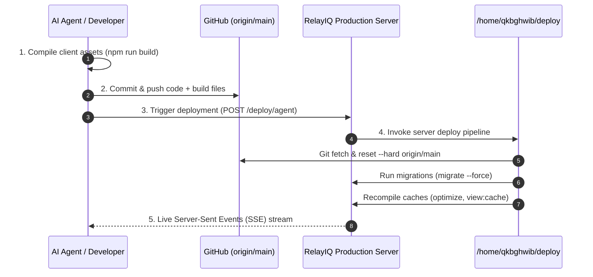

# RelayIQ — Autonomous Agent Deployment Guide

> **Audience**: AI Coding Agents, Automated DevOps Scripts, and Engineers.  
> **Purpose**: This guide provides everything an autonomous agent needs to safely build, commit, push, trigger, and verify deployments to the **RelayIQ** production environment without human manual intervention.

---

## 1. System Overview & Architecture

RelayIQ uses a unified deployment pipeline combining a **Laravel 12 / Inertia / React** stack with a **cPanel production server** (`https://relayiq.app` or configured `DEPLOY_REMOTE_URL`).



---

## 2. Secrets & Environment Configuration

Every agent must look in `LARAVEL_BACKEND/.env` for deployment keys:

| Environment Variable | Description | Example |
| :--- | :--- | :--- |
| `DEPLOY_SECRET` | Primary console password & master deployment secret. | `essem@digital.2030` |
| `DEPLOY_AGENT_KEY` | *(Optional)* Dedicated key for AI agents / CI automation. Defaults to `DEPLOY_SECRET` if not set. | `agent-key-secret-xyz` |
| `DEPLOY_REMOTE_URL` | Base URL of the live production gateway. | `https://relayiq.app` |

---

## 3. The 3-Step Agent Deployment Protocol

Whenever an agent makes frontend or backend code changes, it **MUST** follow this exact 3-step sequence:

### Step 1: Compile Frontend Assets (Vite)
Because RelayIQ's production environment runs on cPanel without active Node daemons, compiled frontend assets in `LARAVEL_BACKEND/public/build` **must be built before pushing**:
```bash
cd LARAVEL_BACKEND
npm run build
```
*(Verify that `npm run build` exits with code 0).*

### Step 2: Commit and Push to GitHub
```bash
cd /path/to/project/root
git add -A
git commit -m "feat(scope): descriptive commit message"
git push origin <branch> # usually 'main'
```
*(Verify that the push succeeded and the commit is on GitHub).*

### Step 3: Trigger Live Agent Deployment Stream
Trigger the deployment endpoint using the secret stored in `LARAVEL_BACKEND/.env`:

```bash
# Extract secret from .env
DEPLOY_KEY=$(grep -E '^DEPLOY_SECRET=' LARAVEL_BACKEND/.env | cut -d '=' -f2-)
REMOTE_URL=$(grep -E '^DEPLOY_REMOTE_URL=' LARAVEL_BACKEND/.env | cut -d '=' -f2-)
[ -z "$REMOTE_URL" ] && REMOTE_URL="https://relayiq.app"
[[ ! "$REMOTE_URL" =~ ^https?:// ]] && REMOTE_URL="https://${REMOTE_URL}"

# Execute streaming trigger
curl -N -s -X POST "${REMOTE_URL}/deploy/agent" \
  -H "X-Deploy-Agent-Key: ${DEPLOY_KEY}" \
  -H "Content-Type: application/json" \
  -H "Accept: text/event-stream" \
  -d '{"branch": "main"}'
```

---

## 4. Alternative Execution Modes

### Mode A: CLI Artisan Command (`php artisan deploy:agent`)
If you have shell/SSH access to the environment:
```bash
# Execute local deployment with real-time stdout streaming:
php artisan deploy:agent main

# Trigger remote production deploy via configured DEPLOY_REMOTE_URL:
php artisan deploy:agent main --remote=https://relayiq.app
```

### Mode B: Direct Web Console Deep Link
If generating a link for the user or automated browser testing:
```
https://relayiq.app/deploy?key=<DEPLOY_SECRET>&branch=main&auto=1
```
* **Auto-Authentication**: Automatically skips the password prompt.
* **Auto-Branch**: Pre-selects `branch=main`.
* **Auto-Execute**: When `auto=1` or `auto=true`, immediately begins the live SSE deployment stream without button clicks.
* **Security Scrub**: The browser immediately removes the `key` parameter from the URL address bar via `history.replaceState`.

---

## 5. Branch Strategies & Target Environments

| Branch | Target Environment | Deployment Impact |
| :--- | :--- | :--- |
| **`main`** | **Production Gateway** (`https://relayiq.app`) | Live website. Updates all user traffic, database schemas, and application caches. |
| **`feature/*`** | Staging / Development testing | Code review and preview deployments. |
| **`backend`** | Core API work | Service endpoints and backend models. |

> [!NOTE]
> Branch names are strictly sanitized with `[^a-zA-Z0-9_\-\/]`. Do not use spaces or special shell characters in branch names.

---

## 6. Pipeline Stages & Expected Output

The live deployment stream emits Server-Sent Events line-by-line as JSON chunks:
`data: {"type": "log", "line": "..."}`

### Typical Successful Deployment Output:
```text
data: {"type":"start","branch":"main","message":"🤖 [Agent Mode] Live deployment stream initiated for [main]..."}
data: {"type":"log","line":"⚡ Running deploy pipeline: /home/qkbghwib/deploy"}
data: {"type":"log","line":"🚀 1. Deploying branch [main] from GitHub..."}
data: {"type":"log","line":"From https://github.com/ManStevoh/SAVIT_CHAT_BOT_SYSTEM"}
data: {"type":"log","line":"* branch              main       -> FETCH_HEAD"}
data: {"type":"log","line":"9af314f5..4bb55813  main       -> origin/main"}
data: {"type":"log","line":"HEAD is now at 4bb55813 style(home): update test deployment modal to red theme"}
data: {"type":"log","line":"🗄️ 2. Checking database migrations..."}
data: {"type":"log","line":"INFO  Nothing to migrate."}
data: {"type":"log","line":"ERROR  The [public/storage] link already exists."}
data: {"type":"log","line":"⚡ 3. Compiling production caches..."}
data: {"type":"log","line":"INFO  Clearing cached bootstrap files."}
data: {"type":"log","line":"config ......................................................... 3.90ms DONE"}
data: {"type":"log","line":"cache ......................................................... 13.95ms DONE"}
data: {"type":"log","line":"compiled ....................................................... 2.55ms DONE"}
data: {"type":"log","line":"events ......................................................... 2.51ms DONE"}
data: {"type":"log","line":"routes ......................................................... 2.89ms DONE"}
data: {"type":"log","line":"views .......................................................... 9.63ms DONE"}
data: {"type":"log","line":"INFO  Caching framework bootstrap, configuration, and metadata."}
data: {"type":"log","line":"config ........................................................ 59.75ms DONE"}
data: {"type":"log","line":"events ......................................................... 4.62ms DONE"}
data: {"type":"log","line":"routes ....................................................... 137.18ms DONE"}
data: {"type":"log","line":"views ......................................................... 86.54ms DONE"}
data: {"type":"log","line":"INFO  Blade templates cached successfully."}
data: {"type":"log","line":"INFO  Events cached successfully."}
data: {"type":"log","line":"✅ Production updated, migrated & optimized successfully to [main]!"}
data: {"type":"log","line":"✅ [SUCCESS] Deployment completed in 6.61s!"}
data: {"type":"done","success":true,"status":"complete","duration":6.61,"message":"Agent deployment completed successfully."}
```

---

## 7. Troubleshooting & Safety Guardrails

### 1. HTTP 409 Conflict (`deploy.lock`)
* **Cause**: A deployment is already running on the server or a previous deployment crashed within the last 10 minutes.
* **Resolution**: Wait 10–30 seconds for the existing deploy to finish. The server automatically cleans stale locks older than 10 minutes (`storage_path('framework/deploy.lock')`).

### 2. HTTP 401 Unauthorized
* **Cause**: Missing or incorrect `DEPLOY_AGENT_KEY` / `DEPLOY_SECRET`.
* **Resolution**: Read the exact value from `LARAVEL_BACKEND/.env` on the server or pass it in header `X-Deploy-Agent-Key: <key>`.

### 3. Changes Not Reflecting on Live Site
* **Cause 1**: Assets were not compiled with `npm run build` before pushing to GitHub.
* **Cause 2**: Browser caching — hard refresh with `Ctrl + F5` or `Cmd + Shift + R`.
* **Cause 3**: Application cache — the pipeline automatically executes `optimize:clear` and `optimize`, but you can verify `/deploy/status/{token}`.

---

## 8. Summary Checklist for Any Future AI Agent

```markdown
- [ ] 1. Make code changes in LARAVEL_BACKEND (PHP/React/CSS).
- [ ] 2. If frontend changes: Run `cd LARAVEL_BACKEND && npm run build`.
- [ ] 3. Run `git add -A && git commit -m "..." && git push origin main`.
- [ ] 4. Read `DEPLOY_SECRET` from `LARAVEL_BACKEND/.env`.
- [ ] 5. Trigger `curl -N -s -X POST "https://relayiq.app/deploy/agent" -H "X-Deploy-Agent-Key: <secret>" -H "Accept: text/event-stream" -H "Content-Type: application/json" -d '{"branch":"main"}'`.
- [ ] 6. Inspect streaming logs for `[SUCCESS] Deployment completed`.
```
