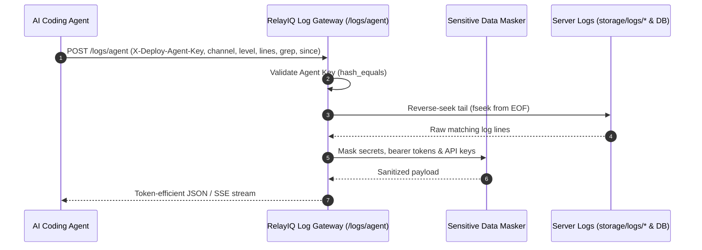

# RelayIQ — Autonomous Agent Log Gateway Guide

> **Audience**: AI Coding Agents, Automated DevOps Scripts, and Site Reliability Engineers.  
> **Purpose**: This guide explains how an autonomous agent can safely query, filter, and live-tail production logs from **RelayIQ** (`https://relayiq.app`) without human intervention and without overloading context window token limits.

---

## 1. Overview & Security Architecture

The Agent Log Gateway exposes a high-performance, reverse-seeking log reader protected by the unified **DevOps Agent Key** (`DEPLOY_AGENT_KEY` / `DEPLOY_SECRET`).



### Core Security & Efficiency Features:
1. **Unified Credential**: Uses the same `DEPLOY_SECRET` / `DEPLOY_AGENT_KEY` as deployment.
2. **Reverse-Seek Tailing**: Never loads 50MB files into memory; reads backwards from the end of the file.
3. **Context-Optimized**: Defaults to 50 lines (clamped to max 500 lines) to prevent exceeding LLM context limits.
4. **Automated Secret Scrubbing**: All API keys, passwords, bearer tokens, and webhook secrets are redacted before transmission.
5. **No Public Leaks**: Completely unauthenticated requests are rejected with `401 Unauthorized`.

---

## 2. Channels & Sources

| Channel Identifier | Source / Destination | Description |
| :--- | :--- | :--- |
| **`laravel`** *(default)* | `storage/logs/laravel.log` | Core application logs, exceptions, webhook processing, queue jobs. |
| **`whatsapp`** | `storage/logs/whatsapp_debug.log` | WhatsApp message lifecycle: webhook reception, deduplication, AI intent resolution, Meta Graph API calls. |
| **`agent`** | `storage/logs/agent-debug.log` | Autonomous commerce agent multi-turn reasoning traces, cognitive cycles, tool executions. |
| **`deploy`** | `storage/logs/deploy.log` | Deployment history audit log (JSON-L format with branch, duration, and status). |
| **`migrate`** | `storage/logs/migrate-cron.log` | Output of automated background database migrations. |
| **`system_db`** | `system_logs` table | High-level system alerts, admin impersonation logs, platform SMTP errors. |
| **`ai_requests`** | `ai_request_logs` table | Individual AI completions, tokens, latency, cost, and failure diagnostics. |
| **`all`** | All log files combined | Unified chronological reverse feed across all active disk log channels. |

---

## 3. Query Parameters & Filters

| Parameter | Type | Default | Description |
| :--- | :--- | :--- | :--- |
| `channel` | `string` | `laravel` | Log channel to query (`laravel`, `whatsapp`, `agent`, `deploy`, `migrate`, `system_db`, `ai_requests`, `all`). |
| `level` | `string` | `all` | Filter by severity: `all`, `error`, `warning`, `info`, `critical`, `debug`. |
| `lines` | `integer` | `50` | Number of recent matching lines to retrieve (1 to 500). |
| `grep` | `string` | `null` | Substring search or regex (e.g. `Payment`, `Webhook`, `Exception`). |
| `since` | `string` | `null` | Relative shorthand (`15m`, `1h`, `24h`, `7d`) or ISO 8601 timestamp. |
| `format` | `string` | `json` | Output format: `json` (structured array), `text` (plain text), or `stream` (SSE live tail). |

---

## 4. How Agents Should Query Logs

### Option A: HTTP REST API (cURL)

```bash
# 1. Read key from .env
DEPLOY_KEY=$(grep -E '^DEPLOY_SECRET=' LARAVEL_BACKEND/.env | cut -d '=' -f2-)
REMOTE_URL=$(grep -E '^DEPLOY_REMOTE_URL=' LARAVEL_BACKEND/.env | cut -d '=' -f2-)
[ -z "$REMOTE_URL" ] && REMOTE_URL="https://relayiq.app"

# 2. Fetch last 50 error logs from Laravel log:
curl -s -X POST "${REMOTE_URL}/logs/agent" \
  -H "X-Deploy-Agent-Key: ${DEPLOY_KEY}" \
  -H "Content-Type: application/json" \
  -d '{"channel": "laravel", "level": "error", "lines": 50}'

# 3. Filter WhatsApp logs for recent failures in the last 1 hour:
curl -s -X POST "${REMOTE_URL}/logs/agent" \
  -H "X-Deploy-Agent-Key: ${DEPLOY_KEY}" \
  -H "Content-Type: application/json" \
  -d '{"channel": "whatsapp", "grep": "FAILED", "since": "1h"}'
```

### Option B: CLI Artisan Tool (`php artisan logs:agent`)

```bash
# Query local logs:
php artisan logs:agent laravel --level=error --lines=30

# Query remote production logs:
php artisan logs:agent whatsapp --remote=https://relayiq.app --grep="AI_GATEWAY" --lines=20

# Live stream remote logs in real-time:
php artisan logs:agent agent --remote=https://relayiq.app --tail
```

---

## 5. Sample Output Format

### JSON Response (`format: "json"`):
```json
{
  "success": true,
  "channel": "whatsapp",
  "count": 2,
  "filters": {
    "level": "error",
    "lines": 50,
    "grep": null,
    "since": "1h"
  },
  "logs": [
    {
      "timestamp": "2026-08-30T12:20:15+00:00",
      "timestamp_unix": 1788092415,
      "level": "ERROR",
      "channel": "whatsapp",
      "stage": "AI_GATEWAY_RESOLVE_FAILED",
      "message": "[AI_GATEWAY_RESOLVE_FAILED] {\"company_id\":1,\"reason\":\"No AI provider configured\"}",
      "raw": "[2026-08-30 12:20:15] [ERROR] [AI_GATEWAY_RESOLVE_FAILED] {\"company_id\":1,\"reason\":\"No AI provider configured\"}"
    }
  ]
}
```

---

## 6. Best Practices for AI Agents

1. **Start Targeted**: Always specify `channel` and `level=error` when investigating bug reports to keep token consumption minimal.
2. **Use Grep**: If debugging a specific chat or webhook, pass `grep: "chat_id: 123"` or `grep: "Order #45"`.
3. **Use Since**: Limit the time window with `since: "30m"` after triggering an action to avoid scanning old history.
