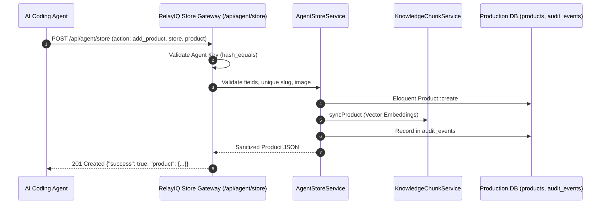

# RelayIQ — Autonomous Agent Store Gateway Guide

> **Audience**: AI Coding Agents, Commerce Agents, and Automated Integrations.  
> **Purpose**: This guide explains how an autonomous agent can list, add, update, archive, and delete catalog items on live RelayIQ stores (`https://relayiq.app`) instantly without requiring code commits or deployments.

---

## 1. Overview & Security Architecture

The Agent Store Gateway exposes a high-performance, validated commerce management endpoint secured with the unified **DevOps Agent Key** (`DEPLOY_AGENT_KEY` / `DEPLOY_SECRET`).



### Core Features:
1. **Instant Updates (50ms)**: Direct database execution; no Git commits, no Vite building, no deployments needed.
2. **Unified Credential**: Uses the same `DEPLOY_SECRET` / `DEPLOY_AGENT_KEY` header (`X-Deploy-Agent-Key`).
3. **AI Vector Knowledge Sync**: Newly created or updated active products automatically sync into the store's WhatsApp AI bot memory (`KnowledgeChunkService`).
4. **Order Safety**: Default deletion archives products (`status: 'inactive'`) to prevent foreign key errors on past orders, while supporting `force_delete: true` for permanent removal.
5. **Batch Importing**: Supports adding dozens of products in a single atomic transaction.

---

## 2. API Reference (`/api/agent/store`)

### Authentication
Include the header:
```http
X-Deploy-Agent-Key: <DEPLOY_SECRET>
```

---

### Actions & Payloads

#### A. List Stores (`action: "list_stores"`)
Get a list of all tenant stores on the platform:
```bash
curl -s -X POST "https://relayiq.app/api/agent/store" \
  -H "X-Deploy-Agent-Key: ${DEPLOY_KEY}" \
  -H "Content-Type: application/json" \
  -d '{"action": "list_stores"}'
```

#### B. List Products (`action: "list_products"`)
List items for a store (by `company_id` or `store_slug`):
```bash
curl -s -X POST "https://relayiq.app/api/agent/store" \
  -H "X-Deploy-Agent-Key: ${DEPLOY_KEY}" \
  -H "Content-Type: application/json" \
  -d '{
    "action": "list_products",
    "store": 1,
    "category": "Coffee",
    "status": "active"
  }'
```

#### C. Add Product (`action: "add_product"`)
Add a new item to the store:
```bash
curl -s -X POST "https://relayiq.app/api/agent/store" \
  -H "X-Deploy-Agent-Key: ${DEPLOY_KEY}" \
  -H "Content-Type: application/json" \
  -d '{
    "action": "add_product",
    "store": 1,
    "product": {
      "name": "Iced Caramel Macchiato",
      "price": 4.50,
      "compare_at_price": 5.50,
      "stock": 50,
      "category": "Espresso Drinks",
      "description": "Rich espresso layered with milk and vanilla syrup, topped with caramel drizzle.",
      "status": "active"
    }
  }'
```

#### D. Update Product (`action: "update_product"`)
Update price, stock, or attributes (match by `product_id`, `name`, or `slug`):
```bash
curl -s -X POST "https://relayiq.app/api/agent/store" \
  -H "X-Deploy-Agent-Key: ${DEPLOY_KEY}" \
  -H "Content-Type: application/json" \
  -d '{
    "action": "update_product",
    "store": 1,
    "name": "Iced Caramel Macchiato",
    "updates": {
      "price": 4.95,
      "stock": 35
    }
  }'
```

#### E. Remove / Archive Product (`action: "remove_product"`)
Safely archive a product (sets `status: 'inactive'`):
```bash
curl -s -X POST "https://relayiq.app/api/agent/store" \
  -H "X-Deploy-Agent-Key: ${DEPLOY_KEY}" \
  -H "Content-Type: application/json" \
  -d '{
    "action": "remove_product",
    "store": 1,
    "name": "Iced Caramel Macchiato"
  }'
```

To permanently delete from database:
```json
{
  "action": "remove_product",
  "store": 1,
  "name": "Iced Caramel Macchiato",
  "force_delete": true
}
```

#### F. Bulk Import (`action: "bulk_import"`)
Add multiple products in a single request:
```bash
curl -s -X POST "https://relayiq.app/api/agent/store" \
  -H "X-Deploy-Agent-Key: ${DEPLOY_KEY}" \
  -H "Content-Type: application/json" \
  -d '{
    "action": "bulk_import",
    "store": 1,
    "items": [
      {"name": "Espresso Single", "price": 2.50, "stock": 100, "category": "Coffee"},
      {"name": "Espresso Double", "price": 3.50, "stock": 100, "category": "Coffee"},
      {"name": "Americano", "price": 3.75, "stock": 50, "category": "Coffee"}
    ]
  }'
```

---

## 3. Artisan CLI Tool (`php artisan store:agent`)

For local development or terminal management:

```bash
# List all registered stores:
php artisan store:agent stores

# List products in Store #1:
php artisan store:agent list --store=1

# Add product locally:
php artisan store:agent add --store=1 --name="Mocha" --price=4.25 --stock=30

# Add product directly to live production server:
php artisan store:agent add --remote=https://relayiq.app --store=1 --name="Mocha" --price=4.25 --stock=30

# Remove product from live production server:
php artisan store:agent remove --remote=https://relayiq.app --store=1 --name="Mocha"
```
