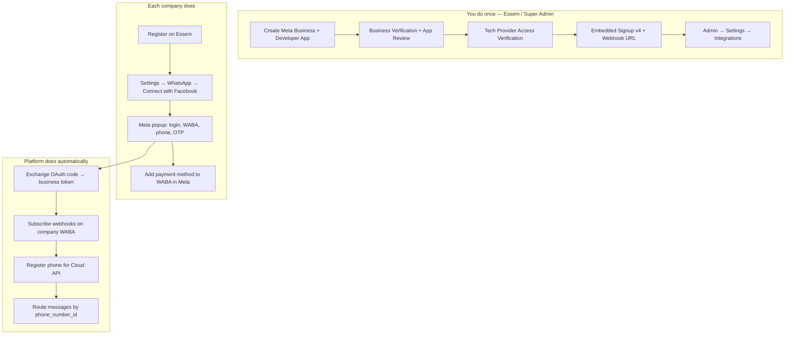

# WhatsApp Complete Setup Guide

This is the **full playbook** for Essem Chat Bot: how **you (super admin)** register with Meta, get API access, configure the platform once, and how **each business** connects their WhatsApp number — including **pricing and who pays for what**.

**Live docs:** [manstevoh.github.io/SAVIT_CHAT_BOT_SYSTEM](https://manstevoh.github.io/SAVIT_CHAT_BOT_SYSTEM/)

---

## 1. How it works (big picture)



| Role | What they need | What they do **not** need |
|------|----------------|---------------------------|
| **Super admin (Essem)** | Meta Developer account, verified business, one Meta app | Per-company Meta apps |
| **Company (tenant)** | Facebook/Meta login, phone for OTP, payment card on WABA | Meta Developer Console, API tokens, webhook setup |

**One Meta app** serves **all companies**. One webhook URL receives all messages; the backend routes by `phone_number_id`.

---

## 2. Prerequisites

### For Essem (platform owner)

- Legal business entity (for Meta Business Verification)
- Domain with HTTPS, e.g. `https://essemchat.essemglobalsolutions.com`
- Laravel app deployed with:
  - `php artisan migrate` (includes WhatsApp migrations)
  - `php artisan queue:work` (required for AI auto-replies)
  - Correct `APP_URL` in `.env`
- Privacy policy URL (required for Meta App Review)
- Facebook/Meta account with admin access to your Business Portfolio

### For each company (tenant)

- Essem account (register at `/register`)
- Active **Essem subscription** (your Stripe/M-Pesa plans — separate from Meta)
- Phone number that can receive SMS/voice OTP
- Number **not** locked to another WhatsApp API provider (unless using **coexist** mode)
- Facebook account to complete Embedded Signup
- **Payment method on their WhatsApp Business Account** in Meta — **only when platform billing model is Tech Provider** (default). With Solution Partner, Essem shares its credit line; see [WhatsApp Meta Billing Model](../WHATSAPP_META_BILLING_MODEL.md).

---

## 3. Part A — Meta registration (super admin, one time)

### Step A1: Meta Business Portfolio

1. Go to [business.facebook.com](https://business.facebook.com) (Meta Business Suite).
2. Create or select a **Business Portfolio** for **Essem Digital Innovation Limited** (or your legal entity name).
3. Complete **Business Verification**:
   - Business name, address, phone, website
   - Upload documents if Meta requests them
   - Approval often takes **2–5 business days**

> Without Business Verification you cannot pass App Review for production use.

### Step A2: Meta Developer account & app

1. Go to [developers.facebook.com](https://developers.facebook.com).
2. **My Apps → Create App**.
3. Choose **Business** type (not Consumer).
4. App name: e.g. `Essem Chat Bot Platform`.
5. Link the app to your **verified Business Portfolio**.
6. Add product: **WhatsApp**.

### Step A3: Become a Tech Provider (required for SaaS)

Essem is a **multi-tenant SaaS** onboarding many businesses. Meta’s path for this is the **Tech Provider** program (not each company creating their own app).

Follow Meta’s official guide:  
[Become a Tech Provider](https://developers.facebook.com/documentation/business-messaging/whatsapp/solution-providers/get-started-for-tech-providers)

**Checklist:**

| Step | Where in Meta | What to submit |
|------|---------------|----------------|
| Business Verification | Business Settings | Company documents |
| App settings | App Dashboard → Settings → Basic | App icon, privacy policy URL, app domain |
| App Review | App Review → Permissions | `whatsapp_business_messaging`, `whatsapp_business_management` |
| Demo videos | App Review | (1) Message sent from your app received in WhatsApp app (2) Template create/manage in your app |
| Access Verification | App Dashboard | Confirm you are a Tech Provider / ISV |
| Switch app to **Live** | App Dashboard | After approvals |

**App Review tips:**

- Provide test login: `superadmin@essem.local` / `password` (or a dedicated reviewer account on your staging URL).
- Explain: *“Multi-tenant SaaS; businesses connect WhatsApp via Embedded Signup; we send/receive on their behalf.”*
- Whitelist your domain under **App Domains** and **Valid OAuth Redirect URIs**.

### Step A4: Embedded Signup v4 configuration

Meta deprecated Embedded Signup v2 — use **v4** before **October 15, 2026**.

1. App Dashboard → **WhatsApp** → **Embedded Signup Builder** (or Configuration).
2. Create a **Facebook Login for Business** configuration (v4).
3. Note down:
   - **App ID** (same as your Meta app ID)
   - **Configuration ID** (Embedded Signup config id)
4. **Allowed domains:** add your production domain, e.g. `essemchat.essemglobalsolutions.com`.
5. **OAuth redirect URI:** add:
   ```
   https://essemchat.essemglobalsolutions.com/dashboard/settings
   ```
   (Must match what you enter in Essem admin settings.)
6. Optional: enable **coexist** in Embedded Signup if companies use **WhatsApp Business mobile app** on the same number (also enable **Enable coexist** in Essem admin).

Official docs: [Embedded Signup](https://developers.facebook.com/docs/whatsapp/embedded-signup/)

### Step A5: Webhook configuration (Meta side)

1. App Dashboard → **WhatsApp** → **Configuration**.
2. **Callback URL:**
   ```
   https://essemchat.essemglobalsolutions.com/api/whatsapp/webhook
   ```
3. **Verify token:** choose a long random string (e.g. `essem_wa_verify_2026_xK9m...`). You will enter the **same** value in Essem admin.
4. Click **Verify and save** (Meta sends GET to your server — app must be running).
5. **Webhook fields** — subscribe at minimum:
   - `messages`
   - `message_template_status_update` (template approvals)
   - `phone_number_name_update` (display name status)
   - `account_update` (optional, account health)

### Step A6: App Secret

1. App Dashboard → **Settings → Basic**.
2. Copy **App Secret** (shown once; store securely).
3. You will paste this in Essem **Admin → Settings → Integrations** as **Meta App Secret** (and again as **Embedded App Secret** if same app).

---

## 4. Part B — Configure Essem platform (super admin)

Log in as super admin → `superadmin@essem.local` / `password` (change in production).

### B1: Deploy & migrate

On your server:

```bash
cd LARAVEL_BACKEND
composer install --no-dev
php artisan migrate --force
npm ci && npm run build
php artisan config:cache
```

Ensure `.env`:

```env
APP_URL=https://essemchat.essemglobalsolutions.com
QUEUE_CONNECTION=database   # or redis
```

Start queue worker (cron or supervisor):

```bash
php artisan queue:work --sleep=3 --tries=3
```

Without the queue worker, **incoming WhatsApp messages will not get AI replies**.

### B2: Admin → Settings → Integrations

URL: `/admin/settings` → **Integrations** tab.

| Field | Value | Notes |
|-------|-------|-------|
| WhatsApp webhook verify token | Same as Meta Configuration | Must match exactly |
| Meta App Secret | From App Dashboard → Basic | Used for webhook signature validation |
| Meta App ID (Embedded Signup) | Your app ID | e.g. `123456789012345` |
| Embedded Signup Config ID | From Embedded Signup Builder | v4 configuration id |
| Meta App Secret (token exchange) | Same app secret | Server exchanges OAuth `code` |
| OAuth redirect URI | `https://your-domain.com/dashboard/settings` | Must be whitelisted in Meta |
| Enable coexist | On only if needed | For WhatsApp Business app numbers |
| **Enable Embedded Signup** | Off during setup / App Review | Turn on when Meta is approved |
| **Enable manual connection** | On (recommended during setup) | Lets companies paste Phone Number ID + token |

Click **Save Integrations**.

The UI shows:

- **Credentials complete: Yes** — App ID, Config ID, and Secret are set  
- **Live for companies: Yes/No** — Embedded Signup toggle + credentials  

**While Meta App Review is pending:** keep Embedded Signup **off**, manual connection **on**, enter webhook verify token + Meta App Secret, then test with manual connect.

### B3: Admin → WhatsApp monitor

URL: `/admin/whatsapp`

Use this to see:

- All company connections
- Onboarding status (`active`, `error`, etc.)
- Phone numbers and errors
- Whether platform Embedded Signup is configured

### B4: Optional `.env` fallbacks

Prefer **Admin UI** (stored in database). Env fallbacks in `LARAVEL_BACKEND/.env.example`:

```env
# WHATSAPP_WEBHOOK_VERIFY_TOKEN=
# META_APP_SECRET=
# WHATSAPP_EMBEDDED_APP_ID=
# WHATSAPP_EMBEDDED_CONFIG_ID=
# WHATSAPP_EMBEDDED_APP_SECRET=
# WHATSAPP_EMBEDDED_REDIRECT_URI=
```

---

## 5. Part C — How a business connects (company user)

Companies can connect in two ways (super admin controls which are available):

### Option A — Connect with Facebook (Embedded Signup)

Requires **Enable Embedded Signup** = on in Admin → Settings → Integrations.

1. Go to `/register` and create a company account.
2. Subscribe to a plan (`/dashboard/subscription`) — **Essem billing**, not Meta.
3. **Dashboard → Settings → WhatsApp Setup** → **Connect with Facebook**
4. Complete Meta popup (WABA + phone + OTP)
5. Add payment method to WABA in Meta when prompted

### Option B — Manual connection

Requires **Enable manual connection** = on (default). Useful when Embedded Signup is off during platform setup or App Review.

1. In Meta Developer Console → WhatsApp → **API Setup**, copy **Phone number ID** and generate a **permanent access token** (system user recommended).
2. **Dashboard → Settings → WhatsApp Setup** → **Manual connection** form
3. Paste Phone Number ID, access token, and optionally WABA ID
4. Click **Connect manually**

The platform webhook URL is shown on the form. Backend verifies the token, subscribes webhooks, and registers the phone — same as Embedded Signup.

### Embedded Signup popup (detail)

When using **Connect with Facebook**, the Meta popup will:

- Log in with Facebook
- Accept WhatsApp / Meta terms
- Select or create **WhatsApp Business Account (WABA)**
- Enter business phone number and complete **SMS or voice OTP**
- Set display name (shown to customers)

Popup closes; Essem shows **Connected** with phone number.

### What Essem does automatically (backend)

1. Receives OAuth `code` from Meta JS SDK (Embedded Signup) or validates manual token
2. Exchanges code for **per-company business access token** (Embedded Signup only)
3. `POST /{WABA_ID}/subscribed_apps` — subscribe webhooks for that business
4. `POST /{PHONE_NUMBER_ID}/register` — register number for Cloud API
5. Stores encrypted token in `whatsapp_accounts` table

### Step C3: Add payment method (Meta — required)

As a **Tech Provider**, each business must add a **payment method to their own WABA** before messaging works at scale.

Direct them to Meta Help:  
[Add a credit card to your WhatsApp Business Platform account](https://www.facebook.com/business/help/)

Or: **WhatsApp Manager** → their WABA → **Payment settings**.

> This pays **Meta’s WhatsApp conversation fees**, not your Essem subscription.

### Step C4: Verify it works

1. From a personal phone, send **Hi** to the business WhatsApp number.
2. Check **Dashboard → Chats** — message should appear.
3. Bot should reply (if AI auto-reply is on and queue worker is running).

### Step C5: Message templates (optional)

**Settings → WhatsApp → Message templates**

- **Submit to Meta** — create utility/marketing/authentication templates
- **Sync from Meta** — pull approved templates
- Required for **marketing** messages outside the 24-hour customer service window

### Disconnect

**Disconnect WhatsApp** in settings — unsubscribes webhooks and deactivates the number in Essem (chat history remains).

---

## 6. Onboarding limits (Meta)

| Stage | Limit |
|-------|-------|
| Default (unverified / dev) | ~10 new businesses per 7 days |
| After Business Verification + App Review + Access Verification | ~200 new businesses per 7 days |
| Higher volume | Apply to become [Meta Business Partner](https://developers.facebook.com/docs/whatsapp/embedded-signup/) |

Monitor in **WhatsApp Manager → Partner overview**.

---

## 7. Architecture reference

### URLs

| Purpose | URL |
|---------|-----|
| Webhook (Meta → Essem) | `{APP_URL}/api/whatsapp/webhook` |
| Company settings | `{APP_URL}/dashboard/settings` |
| Admin monitor | `{APP_URL}/admin/whatsapp` |
| Graph API version | `v22.0` (Embedded Signup v4) |

### API endpoints (for developers)

| Method | Path | Who |
|--------|------|-----|
| GET | `/api/company/whatsapp/embedded/config` | Company |
| POST | `/api/company/whatsapp/embedded/complete` | Company |
| GET | `/api/company/whatsapp/status` | Company |
| POST | `/api/company/whatsapp/disconnect` | Company |
| GET | `/api/company/whatsapp/templates` | Company |
| POST | `/api/company/whatsapp/templates` | Company |
| POST | `/api/company/whatsapp/templates/sync` | Company |
| GET | `/api/admin/whatsapp/connections` | Admin |

Manual token connect (`POST /api/company/whatsapp/connect`) is **disabled** — use Embedded Signup only.

### Message routing

```
Meta POST webhook → phone_number_id in payload
                 → WhatsAppAccount lookup by phone_number_id
                 → company_id → Chat → AI reply job
```

---

## 8. Two separate billing systems

Do not confuse these:

| Bill | Who pays | What it covers |
|------|----------|----------------|
| **Essem subscription** | Company → Essem | Platform access, dashboard, AI, growth, support |
| **Meta WhatsApp fees** | Depends on billing model (below) | WhatsApp conversation charges |

You bill companies via **Stripe / M-Pesa / Paystack** in Essem (`/dashboard/subscription`).

**Meta WhatsApp billing is configurable** by the super admin in **Admin → Settings → Integrations → Meta WhatsApp billing model**. See the full guide: **[WhatsApp Meta Billing Model](WHATSAPP_META_BILLING_MODEL.md)**.

---

## 9. Pricing and billing (Meta WhatsApp)

Meta uses **conversation-based pricing** (not per-SMS). Rates depend on **country** and **conversation category**.

### Conversation categories (simplified)

| Category | Typical use | Who starts |
|----------|-------------|------------|
| **Service** | Customer support replies in 24h window | Often user-initiated |
| **Utility** | Order updates, account notifications | Business (template) |
| **Authentication** | OTP, login codes | Business (template) |
| **Marketing** | Promotions, offers | Business (template) |

### Who pays Meta? (platform toggle)

Configure in **Admin → Settings → Integrations**:

| Billing model | Setting value | Who adds Meta payment | Who receives Meta invoice |
|---------------|---------------|----------------------|---------------------------|
| **Tech Provider** (default) | `tech_provider` | **Each company** on their WABA | Each company (via Meta) |
| **Solution Partner** | `solution_partner` | **Nobody** — Essem shares credit line | **Essem** (aggregated); you bill clients as you choose |

When **Solution Partner** is enabled, Essem automatically calls Meta’s [`whatsapp_credit_sharing_and_attach`](https://developers.facebook.com/docs/marketing-api/reference/extended-credit/whatsapp_credit_sharing_and_attach/) API during company onboarding. You must configure extended credit line ID, system user token, and WABA currency in admin settings.

> **Liability:** In Solution Partner mode, Meta bills **you** for all WhatsApp spend on shared credit lines. You are the Bill-To party.

**Changing the toggle applies to new connections only.** Companies already connected keep the model active when they connected until they disconnect and reconnect.

### Official pricing reference

- [WhatsApp Business Platform pricing](https://developers.facebook.com/docs/whatsapp/pricing)
- [Conversation-based pricing](https://developers.facebook.com/docs/whatsapp/pricing/conversation-based-pricing)
- Rates vary by **market** (e.g. Kenya, Nigeria, US) — check Meta’s rate cards.

### Free tier notes (check Meta for current rules)

- User-initiated **service** conversations often have favorable pricing within the 24-hour window.
- Some markets include **free tier** conversation allowances — verify on Meta’s site for your region.

### How Essem can package pricing (your business decision)

You can:

1. **Pass through (Tech Provider)** — companies pay Meta only; Essem subscription is separate. Enable **Tech Provider** in admin settings.
2. **Bundle (Solution Partner)** — higher Essem plan “includes WhatsApp”; enable **Solution Partner** and share your Meta credit line. You invoice clients for WhatsApp usage (Essem does not auto-rebill Meta costs today).
3. **Switch models** — super admin toggles in **Admin → Settings → Integrations**; affects new connections only. See [WhatsApp Meta Billing Model](WHATSAPP_META_BILLING_MODEL.md).

### Essem subscription plans (platform)

Configured in **Admin → Plans** and billed via Stripe/M-Pesa. This is **independent** of Meta WhatsApp conversation fees.

---

## 10. Production checklist

### Super admin (before go-live)

- [ ] Meta Business Verification **approved**
- [ ] App Review **approved** for `whatsapp_business_messaging` + `whatsapp_business_management`
- [ ] Tech Provider **Access Verification** complete
- [ ] App mode = **Live**
- [ ] Embedded Signup v4 config created
- [ ] Webhook URL verified in Meta
- [ ] All Integrations fields saved in Essem admin
- [ ] `APP_URL` correct in production `.env`
- [ ] Queue worker running
- [ ] `meta_app_secret` set (webhooks rejected in production without it)

### Per company (before they go live)

- [ ] Essem account + active subscription
- [ ] WhatsApp connected via Facebook
- [ ] Payment method on WABA in Meta
- [ ] Test message sent and reply received
- [ ] Display name approved (if required)
- [ ] Templates created for outbound marketing (if needed)

---

## 11. Troubleshooting

| Symptom | Likely cause | Fix |
|---------|--------------|-----|
| “Embedded signup is not enabled” | Missing App ID / Config ID / Secret in admin | Fill Integrations tab |
| Connect button does nothing | Popup blocked | Allow popups for your domain |
| Connected but no inbound messages | Webhook not verified in Meta | Re-verify callback URL + token |
| Webhook 403 in logs | Wrong `meta_app_secret` | Match App Dashboard secret |
| No AI reply | Queue worker not running | `php artisan queue:work` |
| “AI usage limit reached” | Platform AI budget exceeded | Company adds BYOK key or upgrades plan |
| “Subscription expired” | Essem plan lapsed | Renew at `/dashboard/subscription` |
| Phone register failed | Number on another BSP | Use different number or coexist |
| Template rejected | Meta policy | Read rejection reason; edit template |
| Only testers can connect | App still in Dev / Review pending | Complete App Review; switch Live |

**Admin monitor:** `/admin/whatsapp` — check `onboarding_error` per company.

---

## 12. Timeline estimate (first production setup)

| Phase | Duration |
|-------|----------|
| Meta Business Verification | 2–5 business days |
| App Review + Access Verification | 3–10 business days |
| Essem platform config | 1–2 hours |
| First company test connect | 10–15 minutes |
| Display name approval (if needed) | 1–3 days |

---

## 13. Related documentation

- [Company: WhatsApp Connection](user-guide/company-dashboard/whatsapp.md)
- [Super Admin: Platform Settings](user-guide/super-admin/platform-settings.md)
- [Technical: WhatsApp Bot Pipeline](technical/whatsapp-bot.md)
- [Embedded Signup (short reference)](WHATSAPP_EMBEDDED_SIGNUP.md)

---

## 14. Quick start — AI poster + WhatsApp campaign (~10 min)

Use this after WhatsApp is connected and you have at least one **approved Meta template with an IMAGE header** (for marketing outside the 24-hour window).

### Super admin (once)

1. **Gemini / Nano Banana key** (AI posters) — either:
   - **Admin → AI Models → Google Gemini** → paste API key from [Google AI Studio](https://aistudio.google.com/apikey), enable provider  
   - **or** set in server `.env`: `GEMINI_API_KEY=...` (optional: `GEMINI_IMAGE_MODEL=gemini-2.5-flash-image`)
2. **OpenAI key** (captions + chat) — **Admin → Settings → Integrations** → OpenAI API key  
3. Run migrations and queue worker on the server:

```bash
cd LARAVEL_BACKEND
php artisan migrate
php artisan queue:work --sleep=3 --tries=3
```

`queue:work` is required for AI auto-replies **and** queued WhatsApp campaign sends.

### Company — create poster in Growth

1. **Dashboard → Growth → Content**
2. Generate or create a **draft** post with **platform: WhatsApp**
3. Click **Generate poster (AI)** (or **Add image** to upload your own)
4. **Approve** the draft (optional: **Copy post + link** for a share package with tracking URL)

### Company — send via campaign wizard (recommended)

1. **Dashboard → WhatsApp Campaigns** (sidebar)
2. **Creative** — poster is already on the Growth post, or upload / pick from Growth here; use **Generate caption with AI**
3. **Audience** — pick segment (all, active 30d, inactive, ordered); check recipient count vs plan limit
4. **Template** — select approved template with **IMAGE header**; **Test send** to your phone
5. **Send campaign** — messages are queued (~1/sec)

Meta template example: name `promo_poster_v1`, category MARKETING, **header: Image**, body: `{{1}}` (your caption).

### Company — alternative: share package (not mass send)

1. On the Growth post, click **Copy post + link**
2. Paste into WhatsApp manually or share the tracking URL  
3. Does **not** blast all customers — use the **Campaign wizard** for segments

### Limits (typical)

| Feature | Starter | Professional |
|---------|---------|--------------|
| AI images / month | 10 | 50 |
| WhatsApp campaigns / month | 2 | 10 |
| Recipients / campaign | 100 | 1,000 |

---

## 15. Quick reference card

```
SUPER ADMIN (once):
  Meta: Business verify → Create Business app → WhatsApp product
        → App Review → Tech Provider → Embedded Signup v4
        → Webhook: https://YOUR_DOMAIN/api/whatsapp/webhook
  Essem: Admin → Settings → Integrations (Meta fields + toggles)
         Embedded Signup OFF + Manual ON during App Review
         Admin → WhatsApp (monitor)

COMPANY (each):
  Register → Subscribe (Essem) → Settings → WhatsApp
  → Connect with Facebook (when enabled) OR Manual connect (Phone ID + token)
  → Add card in Meta WABA → Test "Hi" message

BILLING:
  Essem plan = you (Stripe/M-Pesa)
  WhatsApp conversations = Meta (company's WABA card)
  Platform AI spend limits = starter $5 / pro $50 per month (BYOK exempt)

AI (super admin):
  Settings → Integrations → AI knowledge & learning
  AI Learning dashboard → review queue, FAQ/learning/product embeddings, quality stats
  AI Usage → platform vs BYOK billing split
  php artisan ai:health-check --notify (daily; embedding coverage alerts)

AI (company):
  Settings → AI → model, language, BYOK, usage split, learning coverage
  Chats → thumbs up/down on bot replies (trains memory quality)
  Settings → AI → Download learning samples CSV (GDPR export)

Campaigns (company):
  Dashboard → WhatsApp Campaigns (wizard: poster + AI caption + segment + template)
  Settings → WhatsApp → Message templates (sync/create from Meta; need IMAGE header for posters)
  Settings → WhatsApp → WhatsApp campaigns (legacy quick-send; wizard preferred)
  Growth → Content → Generate poster (AI) or Add image → Copy post + link (manual share)
  Customers can reply 👍/👎 on WhatsApp to rate last bot answer

AI images (super admin):
  Admin → AI Models → Google Gemini → API key (or GEMINI_API_KEY in .env)

Post-deploy / weekly maintenance:
  php artisan learning:sync-embeddings --missing-only
  php artisan faqs:sync-embeddings
  php artisan products:sync-embeddings --missing-only
```

