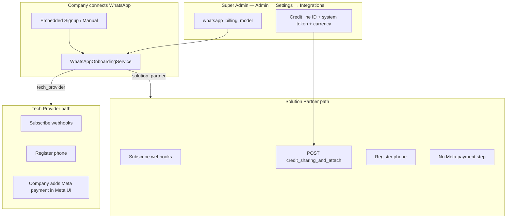

# WhatsApp Meta Billing Model

Essem supports **two Meta-standard billing models** for WhatsApp Cloud API. The super admin chooses **one platform-wide model** in **Admin → Settings → Integrations**. All companies that connect WhatsApp **after you save** use that model.

This is **separate from Essem subscription billing** (Stripe / M-Pesa / Paystack). Companies always pay Essem for platform access; this setting controls **who pays Meta for WhatsApp conversation fees**.

---

## Quick comparison

| | **Tech Provider** (default) | **Solution Partner** |
|---|---------------------------|----------------------|
| **Who pays Meta** | Each company, on their WABA | Essem (platform), via shared credit line |
| **Company adds Meta payment card** | Yes, during Embedded Signup | No — skipped |
| **Meta invoices** | Each company directly | Aggregated invoice to Essem |
| **Essem liability for WhatsApp spend** | None | **Full** — you are Bill-To party |
| **Meta partner program** | Tech Provider | Solution Partner |
| **Essem auto API on connect** | Webhook subscribe + phone register | + `whatsapp_credit_sharing_and_attach` |
| **Typical use** | SaaS where tenants manage own Meta billing | Reseller / bundled WhatsApp pricing |

Official Meta references:

- [Solution Providers overview](https://developers.facebook.com/docs/whatsapp/solution-providers/)
- [Share and revoke credit lines](https://developers.facebook.com/docs/whatsapp/embedded-signup/manage-accounts/share-and-revoke-credit-lines/)
- [Onboarding as Solution Partner](https://developers.facebook.com/documentation/business-messaging/whatsapp/embedded-signup/onboarding-customers-as-a-solution-partner)

---

## Architecture



### Platform settings (database: `platform_settings`)

| Column | API field | Description |
|--------|-----------|-------------|
| `whatsapp_billing_model` | `whatsappBillingModel` | `tech_provider` (default) or `solution_partner` |
| `whatsapp_extended_credit_line_id` | `whatsappExtendedCreditLineId` | Your Meta extended credit line ID |
| `whatsapp_credit_sharing_system_token` | `whatsappCreditSharingSystemToken` | System user token (encrypted, masked in API) |
| `whatsapp_waba_currency` | `whatsappWabaCurrency` | ISO-4217: `USD`, `EUR`, `GBP`, `AUD`, `INR`, `IDR` |

### Per-company tracking (database: `whatsapp_accounts`)

When a company connects, Essem stores which model was active:

| Column | Purpose |
|--------|---------|
| `meta_billing_model` | Snapshot: `tech_provider` or `solution_partner` |
| `credit_allocation_config_id` | Meta allocation ID returned when credit line shared |
| `credit_line_shared_at` | Timestamp when Solution Partner attach succeeded |

**Important:** Changing the platform toggle does **not** retroactively change billing for companies already connected. They keep the model recorded at connect time until they disconnect and reconnect.

---

## Super admin setup

### Option A — Tech Provider (default, current behavior)

1. Go to **Admin → Settings → Integrations**.
2. Set **Billing model** to **Tech Provider — each company pays Meta directly**.
3. Save Integrations.

No extra credentials required. Companies see guidance to add a payment method in Meta during Embedded Signup.

**Meta prerequisites (one-time for Essem):**

- Business Verification
- App Review: `whatsapp_business_messaging`, `whatsapp_business_management`
- [Tech Provider Access Verification](https://developers.facebook.com/documentation/business-messaging/whatsapp/solution-providers/get-started-for-tech-providers)
- Embedded Signup v4 configured

### Option B — Solution Partner (platform credit line)

1. **Become a Meta Solution Partner** and obtain an extended credit line. This is a separate Meta onboarding from Tech Provider and requires Meta Business Partner status.
2. Get your **extended credit line ID**:
   ```bash
   curl "https://graph.facebook.com/v22.0/{BUSINESS_PORTFOLIO_ID}/extendedcredits" \
     -H "Authorization: Bearer {SYSTEM_OR_ADMIN_TOKEN}"
   ```
3. Create a **system user** with Admin or Financial Editor on your business portfolio. Grant your app `business_management`. Generate a **system user access token**.
4. In **Admin → Settings → Integrations**:
   - Set **Billing model** to **Solution Partner**
   - Enter **Extended credit line ID**
   - Enter **System user access token**
   - Choose **Default WABA currency** (must match Meta-supported values)
5. Confirm **Solution Partner ready: Yes** appears, then **Save Integrations**.

From that point, every new WhatsApp connection triggers:

```http
POST /{EXTENDED_CREDIT_LINE_ID}/whatsapp_credit_sharing_and_attach
  ?waba_currency={CURRENCY}&waba_id={CUSTOMER_WABA_ID}
Authorization: Bearer {SYSTEM_TOKEN}
```

Implemented in `WhatsAppCreditSharingService` → called from `WhatsAppOnboardingService` after webhook subscription and before phone registration.

---

## Company experience

### Tech Provider mode

- Embedded Signup popup may prompt for **payment method on WABA**.
- Settings → WhatsApp shows: *"Add a payment method to your WhatsApp Business account in Meta when prompted."*
- `GET /api/company/whatsapp/status` returns `requiresMetaPaymentMethod: true`.

### Solution Partner mode

- Embedded Signup **skips Meta payment collection** (Meta standard for credit-line sharing).
- Settings → WhatsApp shows: *"WhatsApp conversation fees are billed through the platform — no Meta payment card required."*
- On success: *"WhatsApp usage is billed through the platform."*
- `requiresMetaPaymentMethod: false`, `creditLineShared: true` when attach succeeded.

If Solution Partner is selected but credentials are incomplete, connect is **blocked** with HTTP 503 (`platform_billing_not_ready`) before Meta API calls begin — both embedded signup and manual connect.

---

## Disconnect and credit line revocation

When a company disconnects WhatsApp and was onboarded under Solution Partner, Essem revokes the shared credit line:

1. Uses stored `credit_allocation_config_id` if available
2. Otherwise resolves allocation ID via WABA `owner_business_info` + credit line lookup API
3. Calls Meta `DELETE /{allocation_config_id}`
4. Clears local credit fields on the account record

```http
DELETE /{allocation_config_id}
Authorization: Bearer {SYSTEM_TOKEN}
```

If revocation fails (e.g. WABA already unshared in Meta), the disconnect still completes; check admin logs. You can also revoke manually in Meta Business Suite.

Meta recommends revoking credit lines when clients leave or unshare their WABA, to protect your credit line.

---

## Billing liability and pricing strategy

### Solution Partner — you are Bill-To party

Meta’s disclosure (paraphrased): clients onboarded via Embedded Signup with your credit line mean **businesses pay you**, and **you receive an aggregated Meta invoice**. You are liable for all WhatsApp spend on shared credit lines.

### How to price (business decision)

| Strategy | Essem subscription | Meta WhatsApp fees |
|----------|-------------------|-------------------|
| **Pass-through (Tech Provider)** | Standard plans | Company pays Meta directly |
| **Bundled (Solution Partner)** | Higher tier “includes WhatsApp” | You absorb/resell via Essem invoice |
| **Hybrid** | Base plan + WhatsApp usage add-on | You meter and invoice on top of Meta cost |

Essem does **not** currently meter Meta conversation costs for rebilling — you would use Meta’s invoices + your own pricing rules. Platform AI and message limits in Essem plans remain independent.

---

## API reference (internal)

### Admin settings

- `GET /api/admin/settings` — includes `whatsappBillingModel`, `whatsappSolutionPartnerReady`, etc.
- `PUT /api/admin/settings` — set billing model and credentials

### Company WhatsApp status

- `GET /api/company/whatsapp/status` — includes:
  - `metaBillingModel`
  - `requiresMetaPaymentMethod`
  - `platformBillingReady`
  - `creditLineShared`

### Admin connections monitor

- `GET /api/admin/whatsapp/connections` — per connection: `metaBillingModel`, `creditLineSharedAt`, `creditAllocationConfigId`
- Platform summary includes `billingModel`, `solutionPartnerReady`

---

## Troubleshooting

| Issue | Cause | Fix |
|-------|-------|-----|
| Connect fails: "Platform billing is enabled but not configured" | Solution Partner selected, missing credit line or token | Fill credentials in Admin → Settings; verify **Solution Partner ready: Yes** |
| Credit share API permissions error | System token lacks `business_management` or wrong role | Regenerate system user token; ensure Admin/Financial Editor on portfolio |
| Company still asked for Meta payment | Tech Provider mode active, or connected before switch | Check billing model; company may need disconnect/reconnect after switch |
| Credit share fails with invalid currency | Unsupported `whatsapp_waba_currency` | Use one of: AUD, EUR, GBP, IDR, INR, USD |
| Already shared / duplicate errors | WABA already on your credit line | Essem treats as success; check `credit_line_shared_at` |

---

## Switching models safely

1. **Tech Provider → Solution Partner:** New companies skip Meta payment. Existing companies keep direct Meta billing until they reconnect.
2. **Solution Partner → Tech Provider:** New companies must add Meta payment. Existing Solution Partner connections keep shared credit line until disconnect (Essem attempts revoke on disconnect).
3. **Test in staging** with a test WABA before enabling Solution Partner in production.
4. Monitor **Admin → WhatsApp** for `creditLineSharedAt` and onboarding errors.

---

## Code map

| File | Role |
|------|------|
| `app/Services/WhatsApp/WhatsAppBillingModel.php` | Model constants and labels |
| `app/Services/WhatsApp/WhatsAppCreditSharingService.php` | Share/revoke credit line via Graph API |
| `app/Services/WhatsApp/WhatsAppPlatformConfig.php` | Read billing settings from platform config |
| `app/Services/WhatsApp/WhatsAppOnboardingService.php` | Orchestrates connect flow per model |
| `app/Http/Controllers/Api/Admin/PlatformSettingsController.php` | Admin CRUD for billing settings |
| `resources/js/Pages/admin/settings/page.tsx` | Admin UI toggle and credentials |
| `resources/js/Pages/dashboard/settings/page.tsx` | Company-facing billing messaging |

---

## Related docs

- [WhatsApp Complete Setup Guide](WHATSAPP_COMPLETE_SETUP_GUIDE.md) — full Meta registration playbook
- [Platform Settings (super admin)](user-guide/super-admin/platform-settings.md)
- [Meta: Managing credit lines](https://developers.facebook.com/docs/whatsapp/embedded-signup/manage-accounts/share-and-revoke-credit-lines/)
