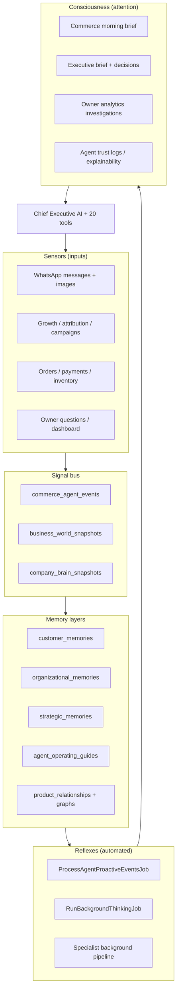

# SAVIT — The Digital Nervous System of a Business

**Verified against production code on 2026-07-11.**

> **Old framing:** WhatsApp + AI + E-commerce = SAVIT  
> **New framing:** **SAVIT = The Digital Nervous System of a Business**

Once you think this way, **every piece of business information becomes a signal the AI can understand** — not rows in tables waiting for a human to query them.

This document is the **strategic north star** and **honest implementation map** for that vision. It connects product concepts (1–24) and the **Business Consciousness Layer** to real PHP services, database tables, jobs, APIs, and tests.

For layer-by-layer engineering detail, see [AI ABI Platform](AI_ABI_PLATFORM.md). For shipped phases, see [Phase 4 OS](AI_PHASE4_OS.md) and [Phase 5 OS](AI_PHASE5_OS.md). For operational modules (subscription, billing, portals, builders), see [Enterprise Platform Blueprint](SAVIT_ENTERPRISE_PLATFORM.md). For model routing, see [AI Model Orchestration](AI_MODEL_ORCHESTRATION.md). For honest gap list, see [Honest Remaining Gaps](HONEST_REMAINING_GAPS.md).

| Verification (2026-07-11) | Result |
|---------------------------|--------|
| `php artisan agent:verify` | **20 tools**, 42 schema checks — OK |
| `php artisan platform:verify` | Enterprise Phase 2 tables + integrations — OK |
| `php artisan test --filter=CommerceAgent` | **95 tests** passing |
| `php artisan test --filter=EnterprisePlatform` | 9 tests passing |
| `php artisan test --filter=AiOrchestration` | 8 tests passing |
| Continuous cognition | Hourly `RunBackgroundThinkingJob` + `ProcessAgentProactiveEventsJob`; daily brief 07:00; post-chat delayed jobs |

---

## The nervous system model

A biological nervous system has **sensors**, **signals**, **memory**, **reflexes**, and **conscious attention**. SAVIT maps these as follows:



**Key insight:** Most software waits for clicks. Most AI waits for questions. The nervous system **continuously senses, prioritizes, and prepares** — so when the owner opens the dashboard, hours of analysis are already done.

---

## Maturity legend

| Status | Meaning |
|--------|---------|
| **Implemented** | Real code + tables + tests or scheduled jobs |
| **Partial** | Foundation exists; missing depth, UI, or full loop |
| **Foundation** | Schema/services wired; not product-complete |
| **Roadmap** | Designed direction; not built |

---

## At-a-glance — 24 concepts

| # | Concept | Status |
|---|---------|--------|
| 1 | Business Graph | **Partial → v2 live** (products, orders, customers, campaigns, manual supplier/warehouse) |
| 2 | AI Timeline | **Partial → implemented** (`business_timeline_events`, sync + Mission Control UI) |
| 3 | Business DNA | Partial (Settings UI + API) |
| 4 | AI Interviews the Business | **Partial** (Settings UI wizard + API) |
| 5 | AI Observability | **Partial → UI live** (trust logs API + explainability cards) |
| 6 | AI Meetings (morning brief) | **Implemented** |
| 7 | AI Whiteboard | Partial (executive plans + simulate) |
| 8 | AI Mission Control | **Partial → unified inbox** (`/dashboard/mission-control`, `GET /api/company/mission-control`) |
| 9 | AI Memory Search | **Partial → unified search** (`POST /api/company/memory-search`) |
| 10 | AI Relationship Intelligence | Partial |
| 11 | AI Digital Twin | Partial (Settings + simulate) |
| 12 | AI Continuous Audits | Partial |
| 13 | AI Knowledge Mining | Partial |
| 14 | AI Business Coach | Partial |
| 15 | AI Team Coach | Roadmap |
| 16 | AI Operating Procedures | Partial |
| 17 | AI Project Manager | Partial |
| 18 | AI Goal Tracking | Partial |
| 19 | AI Business Simulator | **Implemented (foundation)** |
| 20 | AI Company Memory | Partial |
| 21 | AI Marketplace | Foundation |
| 22 | AI Skill Learning | Roadmap |
| 23 | Multi-Channel Brain | Partial (WhatsApp + vision in/out + STT) |
| 24 | AI Economy | Foundation (entitlements + API platform) |
| + | **Business Consciousness Layer** | **Partial — hourly loop live** |

---

## Concept map — all 24 + Consciousness

### 1. Business Graph (not just a database)

**Vision:** Every entity and relationship is traversable — suppliers → products → orders → customers — without hand-written SQL joins.

| Status | **Partial → v2 live** |
|--------|------------------------|
| Today | Customer → orders → products (`CommerceKnowledgeGraphService`, `trace_customer_graph` tool). Product ↔ accessory ↔ warranty (`ProductGraphService`, `product_relationships`). **v2:** `business_graph_nodes` / `business_graph_edges` — products, categories, orders, customers, WhatsApp campaigns; manual supplier/warehouse nodes. **API:** `GET/POST /api/company/business-graph`. |
| Missing | Employees, contracts, competitors as graph nodes. Graph visualization UI. |
| Code | `BusinessGraphV2Service`, `CommerceKnowledgeGraphService`, `ProductGraphService` |
| Tables | `business_graph_nodes`, `business_graph_edges`, `product_relationships` |

---

### 2. AI Timeline

**Vision:** The company’s life as a chronological narrative — branch opened → revenue milestone → supplier change → sales drop → campaign → recovery.

| Status | **Partial → implemented** |
|--------|-------------|
| Today | **`business_timeline_events`** with dedupe by source. Auto-record from commerce events, morning briefs, owner investigations. Backfill via `POST /api/company/business-timeline/sync`. **UI:** Mission Control timeline panel. Background sync via `BackgroundThinkingService`. |
| Missing | Causal linking UI (“supplier changed” → “sales dropped”). Dedicated full-page timeline explorer. |
| Code | `BusinessTimelineService`, `CommerceEventDetector`, `CommerceMorningBriefService`, `OwnerAnalyticsAgentService` |

---

### 3. Business DNA

**Vision:** On signup, AI learns tone, products, pricing, values, competitors, strengths — not forms.

| Status | **Partial** |
|--------|-------------|
| Today | `company_settings.business_dna` JSON + `BusinessDnaService` industry defaults. **Dashboard:** Settings → AI → Business DNA. **API:** `GET/PUT /api/company/settings` (`businessDna`). |
| Missing | Automated discovery on signup; owner interview flow; DNA versioning history. |
| Code | `app/Services/Agent/Cognitive/BusinessDnaService.php` |
| Config | `config/agent.php` → `cognitive.business_dna_defaults` |

---

### 4. AI Interviews the Business

**Vision:** Conversational onboarding — “Tell me about your business” → natural follow-ups → auto-built business model.

| Status | **Partial** |
|--------|-------------|
| Today | `OnboardingInterviewService` — cache-based multi-turn session. `POST /api/company/onboarding-interview/start` + `/respond`. Extracts `business_dna` + `digital_twin` via `AiOrchestrator` and saves to settings. |
| Missing | Dedicated onboarding UI wizard; WhatsApp-hosted interview for owners. |
| Code | `app/Services/Agent/Onboarding/OnboardingInterviewService.php` |

---

### 5. AI Observability

**Vision:** Every recommendation expandable: data used → reasoning → confidence → alternatives → expected outcome.

| Status | **Partial** |
|--------|-------------|
| Today | `agent_trust_logs` with `reasoning_summary`, `tools_used`, `data_consulted`, `confidence`, `explainability` JSON. `agent_reasoning_traces`, `cognitive_episodes`, `agent_tool_invocations` audit trail. |
| Missing | Owner UI “Why did AI recommend this?” on every surface. Standard explainability card component. |
| Code | `AgentTrustService::logDecision()`, `ReasoningEngineService` |
| API | Trust data on executive dashboard; not yet on every customer reply. |

---

### 6. AI Meetings (morning COO briefing)

**Vision:** Every morning: revenue ↑, tickets ↓, inventory risk, marketing performance, one recommendation.

| Status | **Implemented** |
|--------|-----------------|
| Today | `GenerateDailyCommerceBriefJob` (07:00) → `CommerceMorningBriefService` + `ExecutiveBriefService` top decisions. `GET /api/company/commerce-brief`. |
| Partial | No voice/meeting UI; marketing section depends on Growth data richness. |
| Code | `CommerceMorningBriefService`, `ExecutiveBriefService`, `GenerateDailyCommerceBriefJob` |
| Table | `commerce_briefs` |

---

### 7. AI Whiteboard (expansion planning workspace)

**Vision:** Owner types “expand to Uganda” → structured workspace: market, legal, hiring, taxes, inventory, budget, timeline.

| Status | **Partial** |
|--------|-------------|
| Today | `ExecutivePlanningService` → `executive_plans` with director work streams. `POST /api/company/cognitive-ai/plans`. `SimulationService` for scenarios. |
| Missing | Interactive whiteboard UI, geo-expansion templates, collaborative editing. |
| Code | `ExecutivePlanningService`, `SimulationService`, `CognitiveAiController` |

---

### 8. AI Mission Control

**Vision:** One screen — revenue, customers, orders, inventory, marketing, cash flow, alerts — AI highlights only what needs attention.

| Status | **Partial → unified inbox live** |
|--------|-------------|
| Today | **`MissionControlService`** — single attention queue (approvals, events, opportunities, health). **`GET /api/company/mission-control`**. **UI:** `/dashboard/mission-control` (brain digest + attention queue + timeline + graph stats). Explainability: `GET /api/company/mission-control/explainability/{id}`. |
| Missing | Real-time push notifications; mobile-optimized layout. |
| Code | `ExecutiveAiController`, `CognitiveAiController`, `CompanyBrainController`, `BusinessHealthScoreService` |

---

### 9. AI Memory Search

**Vision:** “What happened three months ago when sales dropped?” — search chats, invoices, campaigns, reports, support logs.

| Status | **Partial** |
|--------|-------------|
| Today | `OwnerAnalyticsAgentService` correlates orders + growth + events + brain digest. Vector search on knowledge/products (`KnowledgeChunkService`, `VectorSimilarity`). **Optional pgvector** path on PostgreSQL (`PgVectorSearchService`, `AI_PGVECTOR_ENABLED`). Customer/org/strategic memories. **UI:** `/dashboard/business-intelligence`. |
| Missing | Cross-source semantic search UI (“what happened 3 months ago?”); email/meeting ingestion; unified memory index. |
| Code | `OwnerAnalyticsAgentService`, `SearchKnowledgeTool`, `CustomerMemoryService`, `PgVectorSearchService` |

---

### 10. AI Relationship Intelligence

**Vision:** Full customer relationship graph — bought → complained → referred → tickets → negotiated → returned → bought again.

| Status | **Partial** |
|--------|-------------|
| Today | `trace_customer_graph` tool, `CustomerIntentChainService`, `customer_memories`, sentiment on `chats.detected_sentiment`, order history in profile tool. |
| Missing | Explicit relationship edge types (referred, negotiated, returned); CRM-style relationship score; referral chain visualization. |
| Code | `CommerceKnowledgeGraphService`, `CustomerIntentChainService`, `GetCustomerProfileTool` |

---

### 11. AI Digital Twin

**Vision:** Clone the company; simulate “what if prices +8%?” before deciding.

| Status | **Partial** |
|--------|-------------|
| Today | `company_settings.digital_twin` JSON + `CompanyDigitalTwinService`. `SimulationService` + `POST /api/company/cognitive-ai/simulate`. **Settings UI:** digital twin fields + `agentCouncilEnabled`. |
| Missing | Twin auto-sync from live data; price-change simulation wired to catalog; twin dashboard. |
| Code | `CompanyDigitalTwinService`, `SimulationService` |

---

### 12. AI Continuous Audits

**Vision:** Always-on internal auditor — duplicate customers, wrong pricing, fraud, inventory mismatch, unpaid invoices, broken workflows.

| Status | **Partial** |
|--------|-------------|
| Today | `OpportunityDetectionService` (bundles, restock, slow movers). `CommerceEventDetector` (low_stock, sales_drop, delivery_delay, birthday). Health score factors. |
| Missing | Duplicate customer detection, fraud models, permission audits, invoice reconciliation agent. |
| Code | `OpportunityDetectionService`, `CommerceEventDetector`, `BusinessHealthScoreService` |

---

### 13. AI Knowledge Mining

**Vision:** 100k chats → discover “customers misunderstand delivery fees” → recommend pricing/FAQ/checkout fixes.

| Status | **Partial** |
|--------|-------------|
| Today | `KnowledgeCompressionService` → `knowledge_artifacts`. `ConversationReflectionService` → operating guides. `ToolProposalService` for repeated patterns. Memory extraction job. |
| Missing | Aggregate pattern mining at scale; auto-FAQ PRs; structured improvement tickets. |
| Code | `KnowledgeCompressionService`, `ConversationReflectionService`, `ExtractCustomerMemoriesJob` |
| Tables | `knowledge_artifacts`, `agent_operating_guides`, `tool_proposals` |

---

### 14. AI Business Coach

**Vision:** Weekly: three wins, three risks, three opportunities, one recommendation.

| Status | **Partial** |
|--------|-------------|
| Today | Daily commerce brief + executive decisions. `GrowthStrategyService::generateWeeklyBrief` (Growth module). Owner analytics investigations. |
| Missing | Unified weekly coach format across Commerce + Growth; scheduled coach digest to owner. |
| Code | `CommerceMorningBriefService`, `OwnerAnalyticsAgentService`, Growth `GrowthStrategyService` |

---

### 15. AI Team Coach

**Vision:** Per-employee coaching — close rate, negotiation loss patterns, recommendations.

| Status | **Roadmap** |
|--------|-------------|
| Today | Company-level agents only; no per-employee performance model. |
| Missing | Employee entities, performance signals, team coach service, HR privacy gates. |

---

### 16. AI Operating Procedures (SOPs)

**Vision:** Employees ask “How do I process returns?” — AI answers from company SOPs; update once, everyone gets latest.

| Status | **Partial** |
|--------|-------------|
| Today | `agent_operating_guides` from reflection. `search_faq`, `search_knowledge` tools. Operating guide injection into Chief prompt. |
| Missing | Formal SOP editor, versioning, role-based SOP access, employee-facing channel (not only WhatsApp customers). |
| Code | `AgentOperatingGuideService`, `SearchFaqTool`, `SearchKnowledgeTool` |

---

### 17. AI Project Manager

**Vision:** “Launch new product” → tasks, timeline, dependencies, risks, owners, progress.

| Status | **Partial** |
|--------|-------------|
| Today | `ExecutivePlanningService` breaks goals into work streams → `executive_plans`. Cognitive plans API. |
| Missing | Task graph, dependencies, assignees, Gantt/board UI, progress telemetry. |
| Table | `executive_plans` |

---

### 18. AI Goal Tracking

**Vision:** Goal: Revenue 50M → current 32M → gap 18M → recommendations.

| Status | **Partial** |
|--------|-------------|
| Today | `company_settings.agent_business_goals` + `BusinessGoalService` in Chief prompt. World model `goals[]`. Executive plans KPI targets. Owner analytics compares revenue periods. |
| Missing | Persistent goal progress dashboard, automatic gap analysis each morning, goal-linked action queue. |
| Code | `BusinessGoalService`, `BusinessWorldModelService`, `OwnerAnalyticsAgentService` |

---

### 19. AI Business Simulator

**Vision:** Before hiring / pricing / branching — simulate profit, risk, cash flow, ROI.

| Status | **Implemented (foundation)** |
|--------|------------------------------|
| Today | `SimulationService` compares discount vs bundle vs no-discount scenarios. `POST /api/company/cognitive-ai/simulate`. Tests in `CommerceAgentCognitiveTest`. |
| Missing | Hire/branch/cash-flow models; Monte Carlo; simulator UI for owners. |
| Code | `app/Services/Agent/Cognitive/SimulationService.php` |
| Table | `cognitive_simulations` |

---

### 20. AI Company Memory

**Vision:** Decisions, rationale, lessons, project history survive employee turnover.

| Status | **Partial** |
|--------|-------------|
| Today | `organizational_memories`, `strategic_memories` (tactics + outcomes), operating guides, knowledge artifacts, trust logs, investigations. |
| Missing | Decision provenance linking (who decided, measured outcome months later). Company memory search API. |
| Code | `OrganizationalMemoryService`, `StrategicMemoryService` |

---

### 21. AI Marketplace (industry intelligence modules)

**Vision:** Install School AI, Hospital AI, Retail AI — domain reasoning + tools.

| Status | **Foundation** |
|--------|----------------|
| Today | `SkillModuleRegistry` — retail, restaurant, services, other — prompt addons + tool hints in config. |
| Missing | Marketplace UI, install/uninstall, third-party modules, per-industry tool packs beyond config. |
| Code | `SkillModuleRegistry`, `config/agent.php` → `platform.skill_modules` |

---

### 22. AI Skill Learning (observe → document → assist)

**Vision:** “Teach SAVIT our procurement process” — observe once, document workflow, suggest improvements, later assist with approval.

| Status | **Roadmap** |
|--------|-------------|
| Today | `ToolProposalService` detects repeated tool chains; knowledge compression from confusion patterns. |
| Missing | Screen/workflow recorder, procedural memory store, approved automation replay. |

---

### 23. Multi-Channel Brain

**Vision:** WhatsApp + Instagram + Email + Web + POS + ERP → one unified AI brain, shared context.

| Status | **Partial** |
|--------|-------------|
| Today | WhatsApp primary loop (text + **inbound vision** + **outbound product images** on catalog match). Growth attribution from social. `UnifiedCompanyBrainService` merges commerce + growth. Voice notes → Whisper STT. **AI orchestration** routes reasoning / fast chat / vision / STT by use case (`AiOrchestrator`). |
| Missing | Instagram/Messenger/email ingest channels, cross-channel session continuity, deep ERP/POS signal feeds. |
| Code | `UnifiedCompanyBrainService`, `ProcessIncomingWhatsAppMessage`, `VisionPipelineService`, `VisionOutboundImageService`, `AiOrchestrator`, Growth `AttributionService` |

---

### 24. AI Economy (subscribable agent capabilities)

**Vision:** Developers publish Negotiation Agent, Procurement Agent, Accountant — businesses subscribe à la carte.

| Status | **Foundation** |
|--------|----------------|
| Today | **20 built-in tools**, 3 specialists, `SkillModuleRegistry` (retail/restaurant/services). **Enterprise:** `EntitlementService`, usage meters, API keys, webhooks — pattern for metered capabilities. |
| Missing | Agent SDK, billing per external capability, third-party agent registry, sandbox + approval for external agents. |
| Foundation | `AgentToolRegistry`, `EntitlementService`, `ApiKeyService`, `WebhookDeliveryService` |

---

## The Business Consciousness Layer

> **The feature that could make SAVIT one of the most unique AI business platforms.**

Every few minutes (today: hourly + post-chat), the system asks itself:

| Question | Today (verified behavior) |
|----------|---------------------------|
| What has changed in this business? | `BusinessWorldModelService::snapshot`, `UnifiedCompanyBrainService::buildSnapshot` |
| What deserves the owner's attention? | `CommerceEventDetector`, owner alerts → `company_notifications`, opportunities |
| What decisions are waiting? | `agent_action_requests` (approval queue — refunds, high-risk actions via `AgentApprovalService`) |
| What opportunities appeared? | `OpportunityDetectionService` |
| What risks are increasing? | Health score, sales_drop / low_stock events, causal notes in reasoning |
| Which goals are falling behind? | Goals in world model + owner analytics evidence |
| Which customers need proactive outreach? | Abandoned cart, delivery delay, birthday, reorder signals |
| What can I prepare before anyone asks? | Morning brief, brain snapshot, specialist background runs, reflection guides |

### Consciousness stack (implemented pieces)

```text
Schedule (bootstrap/app.php)
├── Hourly  RunBackgroundThinkingJob
│             → world snapshot, opportunities, health, brain refresh
│             → specialist pipeline, event detection
├── Hourly  ProcessAgentProactiveEventsJob
│             → abandoned carts, reorder, customer events, owner alerts
└── Daily   GenerateDailyCommerceBriefJob (07:00)
              → commerce brief + executive decisions

Post-chat (ProcessIncomingWhatsAppMessage)
├── ExtractCustomerMemoriesJob (delayed)
├── ReflectOnConversationJob (delayed)
└── RunBackgroundThinkingJob (delayed)

Owner-initiated
├── POST /api/company/owner-analytics/investigate
├── GET  /api/company/owner-analytics/investigations
├── GET  /api/company/company-brain
├── POST /api/company/company-brain/refresh
├── POST /api/company/intelligence/reason
├── GET  /api/company/executive-ai/dashboard
└── UI   /dashboard/business-intelligence, /dashboard/agent-ops, /dashboard/executive
```

| Status | **Partial — loop exists; consciousness is not yet sub-minute or owner-UI-complete** |
|--------|----------------------------------------------------------------------------------------|
| Gap | Sub-minute consciousness interval; unified attention inbox; proactive push to owner (email/WhatsApp); measured outcome closure on every recommendation. |

**Competitive shift:** Reactive software → **continuously thinking software**. The owner logs in; the AI has already run analysis and surfaces only what matters.

---

## How this maps to shipped engineering

| Layer | Nervous system role | Doc |
|-------|---------------------|-----|
| Layer 1 Agent OS | Motor nerves — act via **20 tools**, WhatsApp, vision in/out, voice STT | [AI_AGENT_OS](AI_AGENT_OS.md) |
| Layer 2 Company OS | Short-term memory — reasoning, twin, briefs, graph | [AI_COMPANY_OS](AI_COMPANY_OS.md) |
| Layer 3 Platform OS | Vital signs — world model, health, trust, executive | [AI_PLATFORM_OS](AI_PLATFORM_OS.md) |
| Layer 4 Cognitive OS | Prefrontal cortex — debate, confidence, simulation | [AI_COGNITIVE_OS](AI_COGNITIVE_OS.md) |
| Phase 3 | Specialist workers + event bus + product graph | [AI_ABI_PLATFORM](AI_ABI_PLATFORM.md) § B.5 |
| Phase 4 | Vision + unified brain + owner analytics + external bus | [AI_PHASE4_OS](AI_PHASE4_OS.md) |
| Phase 5 | Executive UI + voice commands + approval execution + A/B experiments | [AI_PHASE5_OS](AI_PHASE5_OS.md) |

---

## Signal inventory — what the nervous system senses today

| Signal source | Table / service | Used by |
|---------------|-----------------|---------|
| WhatsApp text | `messages` | Chief agent, perception, memories |
| WhatsApp images (in) | `messages` + `message_vision_analyses` | Vision pipeline → Chief |
| WhatsApp images (out) | Bot `messages` via `VisionOutboundImageService` | Catalog match → product photo reply |
| Voice notes | `messages` (audio) → Whisper STT | Enriched text → Chief |
| Orders / payments | `orders` | World model, analytics, tools |
| Products / stock | `products` | Graph, opportunities, events |
| Customer facts | `customer_memories` | Profile tool, proactive |
| Marketing / attribution | `attribution_events`, Growth services | Brain, marketing tool, briefs |
| Ad spend | `growth_ad_spend_entries` | Growth analytics, brain |
| Social posts | `social_posts` | Top posts in brain |
| Agent events | `commerce_agent_events` | Proactive + owner alerts |
| Integrations | `company_integrations` | DHL, Sendy, CRM webhook, ERP (connectors) |
| Reasoning traces | `agent_reasoning_traces` | Observability, episodes |
| Trust decisions | `agent_trust_logs` | Executive dashboard |
| Domain events | `domain_events` | Webhook fan-out (every minute) |
| AI usage | `ai_request_logs`, `usage_meters` | Billing, orchestration observability |

---

## Roadmap — Phases 5–10

Prioritized by leverage on the **consciousness thesis** (continuous thinking → owner sees only what matters):

| Phase | Theme | Key deliverables | Builds on |
|-------|-------|------------------|-----------|
| **5** ⭐ | **Business Graph v2** | ✅ Supplier/warehouse/campaign nodes; graph REST API; sync from live data | `BusinessGraphV2Service` |
| **5** ⭐ | **Business Timeline** | ✅ `business_timeline_events`; auto-record + sync API; Mission Control timeline panel | `BusinessTimelineService` |
| **5** ⭐ | **Mission Control UI** | ✅ Single attention inbox at `/dashboard/mission-control` | `MissionControlService` |
| **6** | Onboarding Interview | ✅ API live (`OnboardingInterviewService`); UI wizard pending | Concept 4 |
| **6** | Observability UI | ✅ Explainability cards on Mission Control + Executive | `AgentTrustLogController` |
| **7** | Memory Search v2 | ✅ Unified search + chat messages | `BusinessMemorySearchService` |
| **7** | Graph + Timeline in analytics | ✅ Owner investigations include graph/timeline evidence | `OwnerAnalyticsAgentService` |
| **7** | TTS outbound WhatsApp | ✅ Voice reply when inbound was audio + setting enabled | `VoiceOutboundService` |
| **8** | Multi-channel ingest | ✅ Web widget embed + email/IG webhooks + ingest secret | `ChannelWebhookController`, `public/widget/savit-chat.js` |
| **9** | Consciousness v2 | ✅ 5-min sense cycle; owner morning WhatsApp push; outcome tracking on briefs + opportunities | `ConsciousnessSenseCycleService`, `OwnerMorningBriefPushService` |
| **10** | AI Marketplace | ✅ Installable modules + SDK manifest + external webhook tools | `MarketplaceModuleService`, `/dashboard/marketplace` |

**Recommended next build (Phase 6):** Onboarding UI wizard + Observability explainability cards + Memory Search v2.

---

## Dashboard UI map (owner nervous system surfaces)

| Route | Page | Nervous system role |
|-------|------|---------------------|
| `/dashboard/mission-control` | Attention inbox + brain + timeline + graph stats | **Mission control (unified)** |
| `/dashboard/business-intelligence` | Brain snapshot + owner investigations + vector status | Consciousness + memory search entry |
| `/dashboard/executive` | Morning brief, approvals, experiments, opportunities | Mission control (partial) |
| `/dashboard/cognitive` | Reason, simulate, investigation cases | Prefrontal cortex |
| `/dashboard/agent-ops` | Events, alerts, specialist runs, integrations | Reflexes + connectors |
| `/dashboard/growth` | Attribution, campaigns, weekly brief | Marketing sensors |
| `/dashboard/marketplace` | AI module catalog — install industry packs + SDK modules | **Marketplace** |
| `/dashboard/settings` | Agent commerce, DNA, twin, council, proactive | Configuration / DNA |

---

## API surface for nervous system (owner / integrator)

| Endpoint | Nervous system function |
|----------|-------------------------|
| `GET /api/company/company-brain` | Unified commerce + growth state |
| `POST /api/company/company-brain/refresh` | Force consciousness refresh |
| `GET /api/company/owner-analytics/investigations` | Investigation history |
| `POST /api/company/owner-analytics/investigate` | Ask the business a question with evidence |
| `POST /api/company/intelligence/reason` | Structured decision intelligence + cases |
| `GET /api/company/commerce-brief` | Daily COO-style briefing |
| `GET /api/company/executive-ai/dashboard` | Mission control metrics |
| `GET /api/company/executive-ai/opportunities` | Detected opportunities |
| `GET /api/company/cognitive-ai/dashboard` | Cognitive health + episodes |
| `POST /api/company/cognitive-ai/simulate` | Digital twin scenarios |
| `POST /api/company/cognitive-ai/plans` | Whiteboard / planning seeds |
| `GET /api/company/commerce-specialists/runs` | Background specialist consciousness |
| `GET /api/company/commerce-events/owner-alerts` | Low stock, sales drop alerts |
| `GET /api/company/integrations` | DHL, Sendy, CRM, ERP connectors |
| `GET /api/company/knowledge/vector-status` | Embedding search backend (JSON vs pgvector) |
| `GET /api/company/mission-control` | Unified attention inbox + brain digest |
| `GET /api/company/mission-control/explainability/{id}` | Trust log explainability |
| `GET /api/company/business-timeline` | Chronological business timeline |
| `POST /api/company/business-timeline/sync` | Backfill timeline from live signals |
| `GET /api/company/business-graph` | Business graph v2 export |
| `POST /api/company/business-graph/sync` | Sync graph nodes/edges from company data |
| `POST /api/company/onboarding-interview/start` | Start owner onboarding interview |
| `POST /api/company/onboarding-interview/respond` | Continue interview → DNA + twin |
| `GET /api/company/agent-trust-logs` | Recent AI decisions for observability UI |
| `POST /api/company/memory-search` | Unified search across knowledge, timeline, investigations, briefs |
| `GET /api/public/web-widget/config` | Widget greeting + company name |
| `POST /api/public/web-widget/message` | Public web chat message + sync reply |
| `POST /api/webhooks/channels/{id}/email` | Email channel webhook (X-Channel-Ingest-Secret) |
| `GET/POST /api/webhooks/channels/{id}/instagram-dm` | Instagram DM webhook + Meta verify |
| `GET /api/company/channels` | Widget + webhook URLs and tokens |
| `POST /api/company/channels/regenerate-tokens` | Rotate widget token + ingest secret |
| `GET /api/company/intelligence/outcomes` | Pending recommendation outcomes for owner feedback |
| `POST /api/company/intelligence/outcomes` | Record outcome on a recommendation |
| `GET /api/company/marketplace/modules` | AI module catalog + installed list |
| `POST /api/company/marketplace/modules/{key}/install` | Install industry/capability module |
| `DELETE /api/company/marketplace/modules/{key}/install` | Uninstall module |
| `GET /api/agent-sdk/v1/manifest` | Third-party agent SDK specification |

Full REST catalog: [API Reference](api-reference.md) (agent routes being expanded).

---

## Verification commands

```bash
cd LARAVEL_BACKEND
php artisan migrate --force
php artisan agent:verify          # 20 tools, 45 schema checks
php artisan platform:verify       # Enterprise Phase 2
php artisan ai:verify-orchestration
php artisan test --filter=CommerceAgent        # 95 tests
php artisan test --filter=EnterprisePlatform   # 9 tests
php artisan test --filter=AiOrchestration      # 8 tests
php artisan route:list --path=company/company-brain
php artisan route:list --path=company/owner-analytics
```

---

## Related documents

| Document | Purpose |
|----------|---------|
| [AI ABI Platform](AI_ABI_PLATFORM.md) | Engineering master — layers, tools, ABI levels |
| [AI Phase 4 OS](AI_PHASE4_OS.md) | Vision, brain, owner analytics |
| [AI Phase 5 OS](AI_PHASE5_OS.md) | Executive dashboard, approvals, voice, experiments |
| [AI Model Orchestration](AI_MODEL_ORCHESTRATION.md) | Reasoning vs fast chat vs vision vs STT routing |
| [Honest Remaining Gaps](HONEST_REMAINING_GAPS.md) | What is shipped vs roadmap (not oversold) |
| [Enterprise Platform Phase 2](ENTERPRISE_PLATFORM_PHASE2.md) | Billing, entitlements, webhooks, API platform |
| [Growth Engine](growth-engine.md) | Marketing signal source |
| [WhatsApp Bot](whatsapp-bot.md) | Primary customer nerve ending |

**Last verified:** 2026-07-11 — **95** CommerceAgent tests; **20** tools; consciousness jobs in `bootstrap/app.php`; Business Intelligence UI at `/dashboard/business-intelligence`.
