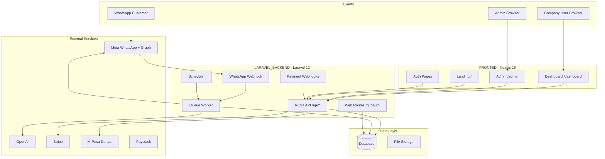

# Architecture Overview

## High-level diagram



## Architectural patterns

| Pattern | Implementation |
|---------|----------------|
| Multi-tenancy | Company-scoped data; `company_id` on all tenant tables |
| API-first | Next.js is pure client; all data via Laravel REST API |
| Async processing | WhatsApp replies, Growth publish, CRM via queue jobs |
| Webhook-driven | Meta, Stripe, M-Pesa, Paystack push events to backend |
| Human-in-the-loop | Growth posts require approve before publish |
| Shared platform secrets | OpenAI key, webhook verify token in platform_settings DB |

## Request flow: WhatsApp message

```
1. Customer sends WhatsApp message
2. Meta POST → /api/whatsapp/webhook
3. WhatsAppWebhookController validates signature, parses payload
4. Resolve company by phone_number_id
5. Create/update Chat, store Message
6. Dispatch ProcessIncomingWhatsAppMessage job
7. Job: greeting → FAQ → keywords → OpenAI → order flow
8. WhatsAppMessageSenderService → Meta send API
9. Customer receives reply in WhatsApp
10. Company sees message in dashboard (SWR poll)
```

## Request flow: Dashboard action

```
1. User logs in → POST /api/auth/login → Sanctum token
2. Token stored in localStorage (auth_token)
3. api-client.ts attaches Authorization: Bearer header
4. SWR hooks fetch data (e.g. GET /api/company/chats)
5. Middleware: auth:sanctum + subscription.active
6. Controller → Service → Model → JSON response
7. React components render data
```

## Deployment topology (production)

| Component | Host | Notes |
|-----------|------|-------|
| Next.js frontend | Vercel | Serverless, edge CDN |
| Laravel API | cPanel VPS | Document root = `public/` |
| Database | MySQL on VPS | SQLite for local dev |
| Queue worker | VPS systemd/Supervisor | `php artisan queue:work` |
| Cron | VPS crontab | `* * * * * php artisan schedule:run` |
| File uploads | Local disk or S3 | Product images, post images |

## Key design decisions

1. **Single WhatsApp webhook** — Platform-wide endpoint; tenant isolation by `phone_number_id`
2. **Database queue default** — No Redis required; suitable for cPanel hosting
3. **Platform OpenAI key** — Centralized billing; companies control behavior not credentials
4. **Attribution via ref codes** — WhatsApp prefill `ref:{slug}` links social to commerce
5. **Subscription middleware** — Hard gate on company routes; webhook still receives but bot sends unavailable message

## Scalability considerations

| Bottleneck | Mitigation |
|------------|------------|
| Queue throughput | Multiple workers, Redis queue in high volume |
| OpenAI latency | FAQ direct match bypasses API; cache common replies |
| Meta rate limits | Queue throttling; exponential backoff on send failures |
| DB connections | Connection pooling; read replicas at scale |

## Monorepo boundaries

Frontend and backend deploy independently:

- Frontend env: `NEXT_PUBLIC_API_URL` points to backend
- Backend env: `FRONTEND_URL`, `SANCTUM_STATEFUL_DOMAINS` for CORS
- No shared code package — API contract is HTTP JSON
