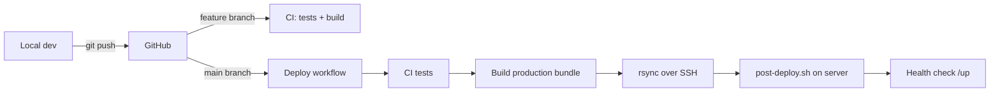

# CI/CD Pipeline

SAVIT Chat Bot is a **Laravel + PHP** application. It **cannot run on Vercel** (Vercel is for static sites and serverless Node). Production lives on your **cPanel/VPS** at `https://savitchat.savitglobalsolutions.com`.

This guide replaces the old **local → Vercel → API** flow with:

```
Local (Windows)  →  GitHub  →  GitHub Actions  →  SSH/rsync  →  Production server
```

**Docs** still deploy separately to GitHub Pages (unchanged).

---

## Why not Vercel?

| Requirement | Vercel | Your server |
|-------------|--------|-------------|
| PHP 8.2 + Laravel | No | Yes |
| MySQL database | No | Yes |
| Queue worker (`queue:work`) | No | Yes (Supervisor) |
| Cron (`schedule:run`) | No | Yes |
| WhatsApp/Stripe webhooks | Awkward | Same domain HTTPS |

The old Next.js frontend on Vercel was **removed**. `vercel.json` keeps auto-deploy **disabled**. You can delete the legacy Vercel project when ready.

---

## Pipeline overview



| Trigger | What runs |
|---------|-----------|
| Push to `feature/inertia-unified` | CI only (PHPUnit + typecheck + Vite build) |
| Pull request | CI only |
| Push to `main` (app changes) | CI + deploy to production |
| Manual **Run workflow** | Deploy to production |

---

## One-time setup

### 1. Production server

On `savitchat.savitglobalsolutions.com` (cPanel or VPS):

1. Upload or clone the app so Laravel lives at a known path, e.g.  
   `/home/username/savitchat/LARAVEL_BACKEND`
2. Document root must point to **`.../LARAVEL_BACKEND/public`**
3. Create production `.env` on the server (never committed, never overwritten by deploy)
4. First-time only:
   ```bash
   cd /path/to/LARAVEL_BACKEND
   composer install --no-dev
   php artisan key:generate   # if new install
   php artisan migrate --force
   php artisan storage:link
   chmod -R 775 storage bootstrap/cache
   ```
5. Enable **SSH** in cPanel (or use VPS SSH key login)
6. Queue worker + cron (see [Deployment](deployment.md))

### 2. Deploy SSH key

On your **local machine**:

```powershell
ssh-keygen -t ed25519 -C "github-actions-savit-deploy" -f $env:USERPROFILE\.ssh\savit_deploy
```

Add the **public** key (`savit_deploy.pub`) to the server:

- cPanel → **SSH Access** → **Manage SSH Keys** → Import → Authorize  
- Or append to `~/.ssh/authorized_keys` on VPS

Test:

```powershell
ssh -i $env:USERPROFILE\.ssh\savit_deploy -p 22 USER@YOUR_SERVER_HOST "echo ok"
```

### 3. GitHub secrets

Repo → **Settings → Secrets and variables → Actions** → **New repository secret**

| Secret | Example | Description |
|--------|---------|-------------|
| `PROD_SSH_HOST` | `savitchat.savitglobalsolutions.com` or server IP | SSH hostname |
| `PROD_SSH_USER` | `savituser` | cPanel/VPS username |
| `PROD_SSH_KEY` | Full private key file contents | From `savit_deploy` (no passphrase recommended for CI) |
| `PROD_SSH_PORT` | `22` | Optional; omit if default |
| `PROD_DEPLOY_PATH` | `/home/savituser/savitchat/LARAVEL_BACKEND` | Absolute path to app root on server |

### 4. GitHub environment (optional but recommended)

Repo → **Settings → Environments** → **New environment** → name: `production`

Add the same secrets there for approval gates (optional: require manual approval before deploy).

The deploy workflow uses `environment: production`.

---

## Day-to-day deploy from local

### Option A — Push to `main` (automatic)

```powershell
cd c:\SAVIT_CHAT_BOT

# develop on feature branch, merge to main when ready
git checkout main
git merge feature/inertia-unified
git push origin main
```

GitHub Actions runs tests, syncs files, migrates, caches, health-checks.

### Option B — Helper script

```powershell
# Push current branch
.\scripts\deploy-from-local.ps1

# Run tests locally first, then push
.\scripts\deploy-from-local.ps1 -RunTests

# Trigger deploy without a new commit (main must already be up to date)
.\scripts\deploy-from-local.ps1 -ManualDeployOnly
```

Requires [GitHub CLI](https://cli.github.com/) logged in for `-ManualDeployOnly`.

### Option C — Manual deploy on server

If CI is unavailable, SSH in and run:

```bash
cd /path/to/LARAVEL_BACKEND
git pull origin main
./deploy.sh
# or after rsync-only updates:
bash scripts/post-deploy.sh
```

---

## What gets synced (and what does not)

**Synced:** application code, `vendor/` (built in CI), `public/build/` (Vite assets)

**Never overwritten:**

- `.env` (production secrets stay on server)
- `storage/logs/*` (log history preserved)
- Server session/cache files (excluded)

**Always run on server after sync:** `scripts/post-deploy.sh` (migrate, cache, queue restart)

---

## Workflows in this repo

| File | Purpose |
|------|---------|
| `.github/workflows/ci.yml` | PHPUnit, typecheck, Vite build |
| `.github/workflows/deploy-production.yml` | Production rsync + post-deploy + `/up` check |
| `.github/workflows/docs-pages.yml` | Docs → GitHub Pages |

---

## Monitoring deploys

- **Actions:** [github.com/ManStevoh/SAVIT_CHAT_BOT_SYSTEM/actions](https://github.com/ManStevoh/SAVIT_CHAT_BOT_SYSTEM/actions)
- **Health:** `curl https://savitchat.savitglobalsolutions.com/up`
- **Logs on server:** `storage/logs/laravel.log`, queue worker log

---

## Troubleshooting

| Problem | Fix |
|---------|-----|
| SSH permission denied | Check `PROD_SSH_KEY`, authorized_keys, `PROD_SSH_USER` |
| rsync: command not found | Use Ubuntu runner (included) — error would be on server side |
| 500 after deploy | SSH in; run `php artisan config:clear`; check `.env` exists |
| Missing CSS/JS | Ensure `public/build/` exists; CI runs `npm run build` before rsync |
| Migrations fail | Fix DB credentials in server `.env`; backup DB before deploy |
| Health check fails | App still starting, wrong docroot, or PHP error — check server logs |
| Deploy runs but old code shows | Wrong `PROD_DEPLOY_PATH` or opcode cache — restart PHP-FPM |

---

## Staging (optional)

To add a staging subdomain (e.g. `staging.savitchat...`):

1. Duplicate `deploy-production.yml` → `deploy-staging.yml`
2. Use secrets prefixed `STAGING_*`
3. Trigger on push to `staging` branch

---

## Related

- [Deployment Guide](deployment.md) — server requirements, cron, queue, webhooks
- [Environment Variables](environment-variables.md)
- [Git Reconnect Guide](../GIT_RECONNECT.md)
