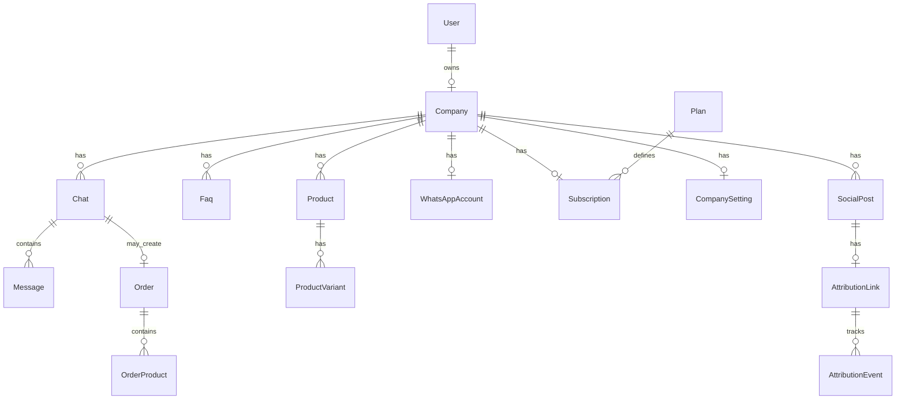

# Database Schema

**Default dev:** SQLite at `LARAVEL_BACKEND/database/database.sqlite`  
**Production:** MySQL/MariaDB recommended  
**Migrations:** 53 files in `database/migrations/`

## Entity relationship overview



## Core models (36 total)

### Identity & tenancy

| Model | Table | Key fields |
|-------|-------|------------|
| `User` | users | name, email, password, role, company_id |
| `Company` | companies | name, category, status, owner_id |
| `CompanySetting` | company_settings | JSON settings blob per company |

**Roles:** `admin`, `company_owner`, team member

### Commerce

| Model | Table | Key fields |
|-------|-------|------------|
| `Product` | products | company_id, name, price, category, availability |
| `ProductVariant` | product_variants | product_id, name, price, sku |
| `ProductImage` | product_images | polymorphic product/variant |
| `Faq` | faqs | company_id, question, answer, keywords, active |
| `Order` | orders | company_id, chat_id, total, status, payment_status |
| `OrderProduct` | order_products | order_id, product_id, quantity, price |

### Messaging

| Model | Table | Key fields |
|-------|-------|------------|
| `Chat` | chats | company_id, customer_phone, agent_active, social_post_id |
| `Message` | messages | chat_id, direction, body, whatsapp_message_id |
| `WhatsAppAccount` | whatsapp_accounts | company_id, phone_number_id, access_token (encrypted) |
| `ConversationLearningSample` | conversation_learning_samples | AI training samples |

### Billing

| Model | Table | Key fields |
|-------|-------|------------|
| `Plan` | plans | name, slug, price, features, stripe_price_id, trial_days |
| `Subscription` | subscriptions | company_id, plan_id, status, stripe_id, period dates |
| `PaymentGateway` | payment_gateways | slug, config JSON (encrypted fields) |

### Platform

| Model | Table | Key fields |
|-------|-------|------------|
| `PlatformSetting` | platform_settings | key-value platform config |
| `SystemLog` | system_logs | level, message, context, company_id |
| `Testimonial` | testimonials | landing page testimonials |
| `LandingFaq` | landing_faqs | public landing FAQs |
| `CompanyNotification` | company_notifications | in-app notifications |

### Growth Engine

| Model | Table | Purpose |
|-------|-------|---------|
| `SocialAccount` | social_accounts | OAuth platform connections |
| `SocialPost` | social_posts | Draft/scheduled/published content |
| `SocialPostMetric` | social_post_metrics | Reach, clicks, engagement |
| `AttributionLink` | attribution_links | Short link slug + WhatsApp prefill |
| `AttributionEvent` | attribution_events | click, whatsapp_start, lead, order, revenue |
| `CompetitorProfile` | competitor_profiles | Tracked competitors |
| `CompetitorSnapshot` | competitor_snapshots | Point-in-time competitor data |
| `GrowthInsight` | growth_insights | AI recommendations |
| `GrowthAgentRun` | growth_agent_runs | Agent pipeline execution log |
| `GrowthIntegration` | growth_integrations | GA4, email, CRM connections |
| `GrowthAdSpendEntry` | growth_ad_spend_entries | Manual/imported ad spend |
| `GrowthBrandProfile` | growth_brand_profiles | Brand voice for AI content |
| `GrowthLearningPattern` | growth_learning_patterns | Extracted winning patterns |
| `GrowthOauthState` | growth_oauth_states | OAuth CSRF state tokens |
| `PortfolioRecommendation` | portfolio_recommendations | Admin cross-brand AI recs |

## Key indexes & constraints

- `whatsapp_accounts.phone_number_id` — unique; webhook company lookup
- `messages.whatsapp_message_id` — deduplication of webhook retries
- `attribution_links.slug` — unique; public `/g/{slug}` route
- `users.email` — unique
- Foreign keys cascade on company delete (configurable)

## Queue & session tables

Laravel defaults when using database driver:

- `jobs` — pending queue jobs
- `failed_jobs` — failed job log
- `sessions` — session storage
- `cache` — database cache
- `personal_access_tokens` — Sanctum tokens

## Seeders

| Seeder | Data |
|--------|------|
| `PlanSeeder` | Starter, Growth, Enterprise plans |
| `DatabaseSeeder` | Calls all seeders |
| Super admin user | `admin@essem.local` (via env or default) |
| `PaymentGatewaySeeder` | Stripe, M-Pesa, Paystack stubs |
| `CompanySeeder` | Sample company for dev |

## Migration commands

```bash
php artisan migrate              # Run pending
php artisan migrate:fresh --seed # Reset + seed (dev only)
php artisan migrate:status       # Check status
```

## Chat order state

Order flow state stored in `chats` metadata or dedicated conversation state fields (see `OrderFlowService`). State resets on order completion or timeout.

## Attribution linkage

```
social_posts.id → attribution_links.social_post_id
attribution_links.id → chats.attribution_link_id
social_posts.id → orders.social_post_id (on conversion)
```

## Encryption at rest

| Column | Model |
|--------|-------|
| access_token | WhatsAppAccount |
| Gateway secrets | PaymentGateway config JSON |
| OAuth tokens | SocialAccount |

Uses Laravel `Crypt` facade with `APP_KEY`.
